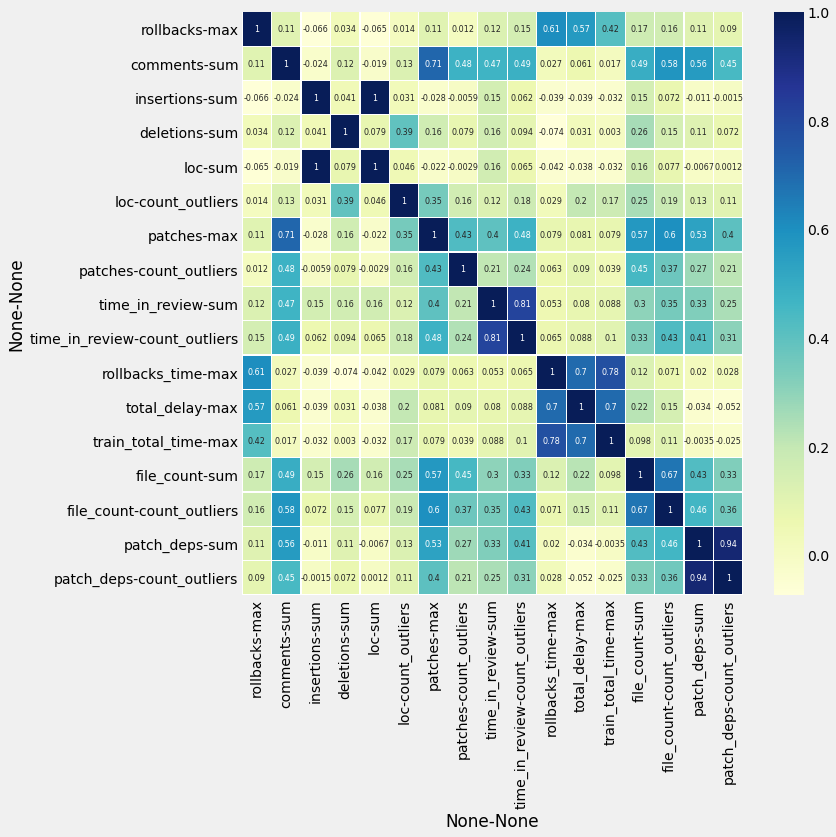

# Train Stats

```
 ----------------------------------------------------------------------------------------
/                                                                                        \
| /$$$$$$$$                 /$$            /$$$$$$   /$$                 /$$             |
||__  $$__/                |__/           /$$__  $$ | $$                | $$             |
|   | $$  /$$$$$$  /$$$$$$  /$$ /$$$$$$$ | $$  \__//$$$$$$    /$$$$$$  /$$$$$$   /$$$$$$$|
|   | $$ /$$__  $$|____  $$| $$| $$__  $$|  $$$$$$|_  $$_/   |____  $$|_  $$_/  /$$_____/|
|   | $$| $$  \__/ /$$$$$$$| $$| $$  \ $$ \____  $$ | $$      /$$$$$$$  | $$   |  $$$$$$ |
|   | $$| $$      /$$__  $$| $$| $$  | $$ /$$  \ $$ | $$ /$$ /$$__  $$  | $$ /$$\____  $$|
|   | $$| $$     |  $$$$$$$| $$| $$  | $$|  $$$$$$/ |  $$$$/|  $$$$$$$  |  $$$$//$$$$$$$/|
|   |__/|__/      \_______/|__/|__/  |__/ \______/   \___/   \_______/   \___/ |_______/ |
|                                                                                        |
|                                                                                        |
|                                                                                        |
|                                      🚂 ¯\_(ツ)_/¯?                                     |
\                                                                                        /
 ----------------------------------------------------------------------------------------
    \     
     \     
      \      
           ___ ____
         ⎛   ⎛ ,----
          \  //==--'
     _//|,.·//==--'    ____________________________
    _OO≣=-  ︶ ᴹw ⎞_§ ______  ___\ ___\ ,\__ \/ __ \
   (∞)_, )  (     |  ______/__  \/ /__ / /_/ / /_/ /
     ¨--¨|| |- (  / ______\____/ \___/ \__^_/  .__/
         ««_/  «_/ jgs/bd808                /_/
```

In which I look at data from the past several hundred trains and pretend that I know how to do exploratory data analysis.


```python
import pandas as pd
from matplotlib import pyplot as plt
import seaborn as sns

from sqlalchemy import create_engine

engine = create_engine('sqlite:///data/train.db')
df = pd.read_sql('''
SELECT
    version,
    rollbacks,
    rollbacks_time,
    patches,
    group0_delay_days,
    group1_delay_days,
    group2_delay_days,
    (group0_delay_days +
     group1_delay_days +
     group2_delay_days) as total_delay,
    total_time as train_total_time,
    comments,
    insertions,
    deletions,
    time_in_review,
    loc,
    patch_deps,
    link,
    (select count(*) from file f where f.patch_id = p.id) as file_count
FROM train t
JOIN patch p ON p.train_id = t.id
''', engine)

# Makes your data 538% better...I think
plt.style.use('fivethirtyeight')
```

# 🧐 Preliminary thinking

thinking....

Looking at the dataset desribed below it mostly looks correct. I note that the max of the `group[N]_delay_days` is `6` for every day and I'm doing some `N % 7` math somewhere on `.isoweekday()` so that's probably under-reporting. Overall the data looks ok. 👌

# 📑 Aggregation

There is 1×`csv`/train and each row is a patch that went out with that train. Information that is true for an **entire train** (like the _number of patches_, the _number of rollbacks_, the _train conductor_, etc) is **repeated** for every row. The data in the `csv` files is not normalized. It's like a "left join".

We need to aggregate differently per column. Some columns should be the `max`, others should be `sum`med.


```python
# from scipy import stats
import numpy

def count_outliers(x):
    return len(x[x > df[x.name].quantile(0.95)])

agg_df = df.groupby('version').agg({
#    'conductor': lambda x:stats.mode(x)[0],  # I don't know that I care about this…keeping it here to save me from looking at StackOverflow®™©
    'rollbacks': 'max',
    'comments': 'sum',
    'insertions': 'sum',
    'deletions': 'sum',
    'loc': ['sum', count_outliers],
    'patches': 'sum',
    'time_in_review': ['sum', count_outliers],
    'patches': ['max', count_outliers],
    'rollbacks_time': 'max',
    'total_delay': 'max',
    'train_total_time': 'max',
    'file_count': ['sum', count_outliers],
    'patch_deps': ['sum', count_outliers],
})
agg_df.head()
```


<div>
<style scoped>
    .dataframe tbody tr th:only-of-type {
        vertical-align: middle;
    }

    .dataframe tbody tr th {
        vertical-align: top;
    }

    .dataframe thead tr th {
        text-align: left;
    }

    .dataframe thead tr:last-of-type th {
        text-align: right;
    }
</style>
<table border="1" class="dataframe">
  <thead>
    <tr>
      <th></th>
      <th>rollbacks</th>
      <th>comments</th>
      <th>insertions</th>
      <th>deletions</th>
      <th colspan="2" halign="left">loc</th>
      <th colspan="2" halign="left">patches</th>
      <th colspan="2" halign="left">time_in_review</th>
      <th>rollbacks_time</th>
      <th>total_delay</th>
      <th>train_total_time</th>
      <th colspan="2" halign="left">file_count</th>
      <th colspan="2" halign="left">patch_deps</th>
    </tr>
    <tr>
      <th></th>
      <th>max</th>
      <th>sum</th>
      <th>sum</th>
      <th>sum</th>
      <th>sum</th>
      <th>count_outliers</th>
      <th>max</th>
      <th>count_outliers</th>
      <th>sum</th>
      <th>count_outliers</th>
      <th>max</th>
      <th>max</th>
      <th>max</th>
      <th>sum</th>
      <th>count_outliers</th>
      <th>sum</th>
      <th>count_outliers</th>
    </tr>
    <tr>
      <th>version</th>
      <th></th>
      <th></th>
      <th></th>
      <th></th>
      <th></th>
      <th></th>
      <th></th>
      <th></th>
      <th></th>
      <th></th>
      <th></th>
      <th></th>
      <th></th>
      <th></th>
      <th></th>
      <th></th>
      <th></th>
    </tr>
  </thead>
  <tbody>
    <tr>
      <th>1.31.0-wmf.1</th>
      <td>0</td>
      <td>1416</td>
      <td>6364</td>
      <td>4758</td>
      <td>11122</td>
      <td>2</td>
      <td>399</td>
      <td>0</td>
      <td>243846663</td>
      <td>14</td>
      <td>0</td>
      <td>0</td>
      <td>180742</td>
      <td>1072</td>
      <td>13</td>
      <td>128</td>
      <td>2</td>
    </tr>
    <tr>
      <th>1.31.0-wmf.11</th>
      <td>1</td>
      <td>1799</td>
      <td>77419</td>
      <td>68374</td>
      <td>145793</td>
      <td>8</td>
      <td>335</td>
      <td>0</td>
      <td>222575732</td>
      <td>8</td>
      <td>5833</td>
      <td>0</td>
      <td>173546</td>
      <td>1109</td>
      <td>15</td>
      <td>425</td>
      <td>37</td>
    </tr>
    <tr>
      <th>1.31.0-wmf.12</th>
      <td>0</td>
      <td>1307</td>
      <td>8200</td>
      <td>4387</td>
      <td>12587</td>
      <td>4</td>
      <td>374</td>
      <td>0</td>
      <td>102222853</td>
      <td>5</td>
      <td>0</td>
      <td>0</td>
      <td>187456</td>
      <td>797</td>
      <td>6</td>
      <td>160</td>
      <td>9</td>
    </tr>
    <tr>
      <th>1.31.0-wmf.15</th>
      <td>0</td>
      <td>3887</td>
      <td>42063</td>
      <td>31584</td>
      <td>73647</td>
      <td>23</td>
      <td>756</td>
      <td>0</td>
      <td>554129449</td>
      <td>21</td>
      <td>0</td>
      <td>0</td>
      <td>188190</td>
      <td>2668</td>
      <td>30</td>
      <td>469</td>
      <td>29</td>
    </tr>
    <tr>
      <th>1.31.0-wmf.16</th>
      <td>1</td>
      <td>1708</td>
      <td>13006</td>
      <td>8376</td>
      <td>21382</td>
      <td>4</td>
      <td>288</td>
      <td>0</td>
      <td>184008614</td>
      <td>16</td>
      <td>431612</td>
      <td>12</td>
      <td>562921</td>
      <td>1999</td>
      <td>22</td>
      <td>150</td>
      <td>8</td>
    </tr>
  </tbody>
</table>
</div>


## I _think_ ☝️ looks 🌠

…carrying on then.

Below is the correlation between all the numeric data in our set.


```python
fig, ax = plt.subplots(figsize=(10,10))         # Sample figsize in inches
sns.heatmap(agg_df.corr(), annot=True, cmap="YlGnBu", linewidths=0.3, annot_kws={"size": 8}, ax=ax)
plt.xticks(rotation=90)
plt.yticks(rotation=0)
plt.show()
```


    

    


```python
from IPython.display import display

patch_df = pd.read_sql('''
    select
        t.version,
        filename,
        count(f.filename) as filename_count
    from file f
    join patch p on f.patch_id = p.id
    join train t on t.id = p.train_id
    group by filename, t.version
    order by filename_count desc;''', engine)
display(patch_df[patch_df['version'] == '1.37.0-wmf.3'])
```


<div>
<style scoped>
    .dataframe tbody tr th:only-of-type {
        vertical-align: middle;
    }

    .dataframe tbody tr th {
        vertical-align: top;
    }

    .dataframe thead th {
        text-align: right;
    }
</style>
<table border="1" class="dataframe">
  <thead>
    <tr style="text-align: right;">
      <th></th>
      <th>version</th>
      <th>filename</th>
      <th>filename_count</th>
    </tr>
  </thead>
  <tbody>
    <tr>
      <th>174</th>
      <td>1.37.0-wmf.3</td>
      <td>extension.json</td>
      <td>35</td>
    </tr>
    <tr>
      <th>302</th>
      <td>1.37.0-wmf.3</td>
      <td>repo/includes/WikibaseRepo.php</td>
      <td>23</td>
    </tr>
    <tr>
      <th>469</th>
      <td>1.37.0-wmf.3</td>
      <td>RELEASE-NOTES-1.37</td>
      <td>15</td>
    </tr>
    <tr>
      <th>590</th>
      <td>1.37.0-wmf.3</td>
      <td>composer.json</td>
      <td>13</td>
    </tr>
    <tr>
      <th>666</th>
      <td>1.37.0-wmf.3</td>
      <td>i18n/en.json</td>
      <td>12</td>
    </tr>
    <tr>
      <th>...</th>
      <td>...</td>
      <td>...</td>
      <td>...</td>
    </tr>
    <tr>
      <th>197036</th>
      <td>1.37.0-wmf.3</td>
      <td>wikimedia/remex-html/RemexHtml/DOM/DOMBuilder.php</td>
      <td>1</td>
    </tr>
    <tr>
      <th>197045</th>
      <td>1.37.0-wmf.3</td>
      <td>wikimedia/remex-html/RemexHtml/GenerateDataFil...</td>
      <td>1</td>
    </tr>
    <tr>
      <th>197402</th>
      <td>1.37.0-wmf.3</td>
      <td>wikimedia/zest-css/CHANGELOG.md</td>
      <td>1</td>
    </tr>
    <tr>
      <th>197410</th>
      <td>1.37.0-wmf.3</td>
      <td>wikimedia/zest-css/src/Zest.php</td>
      <td>1</td>
    </tr>
    <tr>
      <th>197416</th>
      <td>1.37.0-wmf.3</td>
      <td>wikimedia/zest-css/src/ZestInst.php</td>
      <td>1</td>
    </tr>
  </tbody>
</table>
<p>1261 rows × 3 columns</p>
</div>


```python

```
