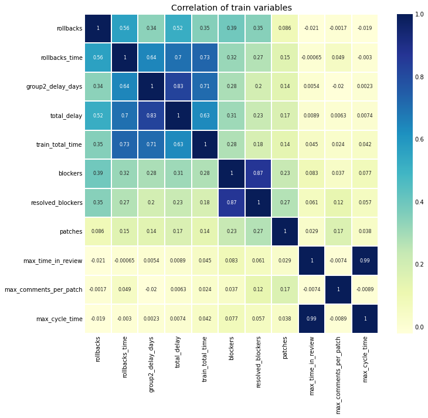
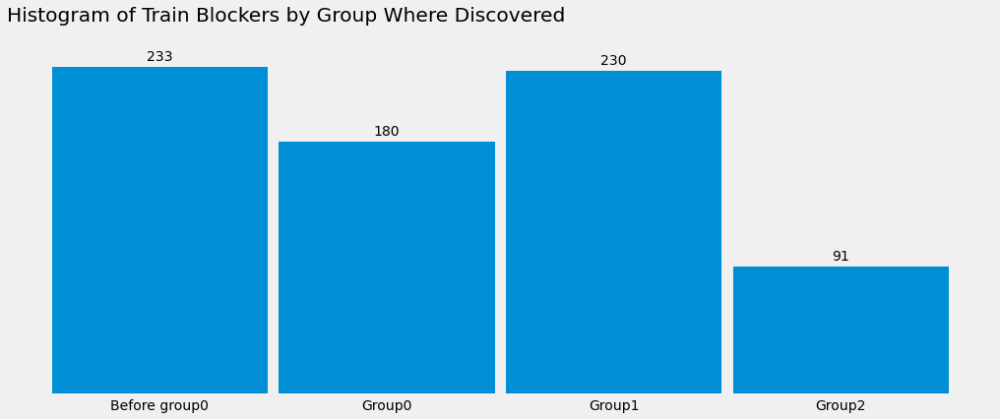

# Train Stats

```
 ----------------------------------------------------------------------------------------
/                                                                                        \
| /$$$$$$$$                 /$$            /$$$$$$   /$$                 /$$             |
||__  $$__/                |__/           /$$__  $$ | $$                | $$             |
|   | $$  /$$$$$$  /$$$$$$  /$$ /$$$$$$$ | $$  \__//$$$$$$    /$$$$$$  /$$$$$$   /$$$$$$$|
|   | $$ /$$__  $$|____  $$| $$| $$__  $$|  $$$$$$|_  $$_/   |____  $$|_  $$_/  /$$_____/|
|   | $$| $$  \__/ /$$$$$$$| $$| $$  \ $$ \____  $$ | $$      /$$$$$$$  | $$   |  $$$$$$ |
|   | $$| $$      /$$__  $$| $$| $$  | $$ /$$  \ $$ | $$ /$$ /$$__  $$  | $$ /$$\____  $$|
|   | $$| $$     |  $$$$$$$| $$| $$  | $$|  $$$$$$/ |  $$$$/|  $$$$$$$  |  $$$$//$$$$$$$/|
|   |__/|__/      \_______/|__/|__/  |__/ \______/   \___/   \_______/   \___/ |_______/ |
|                                                                                        |
|                                                                                        |
|                                                                                        |
|                                      🚂 ¯\_(ツ)_/¯?                                     |
\                                                                                        /
 ----------------------------------------------------------------------------------------
    \     
     \     
      \      
           ___ ____
         ⎛   ⎛ ,----
          \  //==--'
     _//|,.·//==--'    ____________________________
    _OO≣=-  ︶ ᴹw ⎞_§ ______  ___\ ___\ ,\__ \/ __ \
   (∞)_, )  (     |  ______/__  \/ /__ / /_/ / /_/ /
     ¨--¨|| |- (  / ______\____/ \___/ \__^_/  .__/
         ««_/  «_/ jgs/bd808                /_/
```

In which I look at data from the past several hundred trains and pretend that I know how to do exploratory data analysis.


```python
import pandas as pd
from matplotlib import pyplot as plt
import seaborn as sns

from sqlalchemy import create_engine

engine = create_engine('sqlite:///data/train.db')
df = pd.read_sql('''
SELECT
    version,
    rollbacks,
    rollbacks_time,
    patches,
    group2_delay_days,
    (group0_delay_days +
     group1_delay_days +
     group2_delay_days) as total_delay,
    total_time as train_total_time,
    (select sum(time_in_review) from patch p where p.train_id = t.id) as time_in_review,
    (select sum(comments) from patch where patch.train_id = t.id) as comments,
    (select count(*) from blocker b where b.train_id = t.id and resolved = 1) as blockers
FROM train t
''', engine)

# Makes your data 538% better...I think
plt.style.use('fivethirtyeight')
df.head()
```


<div>
<table border="1" class="dataframe">
  <thead>
    <tr style="text-align: right;">
      <th></th>
      <th>version</th>
      <th>rollbacks</th>
      <th>rollbacks_time</th>
      <th>patches</th>
      <th>group2_delay_days</th>
      <th>total_delay</th>
      <th>train_total_time</th>
      <th>time_in_review</th>
      <th>comments</th>
      <th>blockers</th>
    </tr>
  </thead>
  <tbody>
    <tr>
      <th>0</th>
      <td>1.37.0-wmf.1</td>
      <td>0</td>
      <td>0</td>
      <td>450</td>
      <td>0</td>
      <td>0</td>
      <td>178349</td>
      <td>376214457</td>
      <td>1175</td>
      <td>3</td>
    </tr>
    <tr>
      <th>1</th>
      <td>1.37.0-wmf.3</td>
      <td>3</td>
      <td>94493</td>
      <td>366</td>
      <td>0</td>
      <td>1</td>
      <td>219880</td>
      <td>381894655</td>
      <td>1263</td>
      <td>6</td>
    </tr>
    <tr>
      <th>2</th>
      <td>1.37.0-wmf.4</td>
      <td>1</td>
      <td>66812</td>
      <td>422</td>
      <td>1</td>
      <td>3</td>
      <td>263742</td>
      <td>328555632</td>
      <td>1341</td>
      <td>4</td>
    </tr>
    <tr>
      <th>3</th>
      <td>1.36.0-wmf.1</td>
      <td>0</td>
      <td>0</td>
      <td>566</td>
      <td>4</td>
      <td>4</td>
      <td>519622</td>
      <td>305598768</td>
      <td>1113</td>
      <td>1</td>
    </tr>
    <tr>
      <th>4</th>
      <td>1.36.0-wmf.2</td>
      <td>4</td>
      <td>389769</td>
      <td>273</td>
      <td>4</td>
      <td>5</td>
      <td>554704</td>
      <td>283073424</td>
      <td>899</td>
      <td>1</td>
    </tr>
  </tbody>
</table>
</div>


```python
fig, ax = plt.subplots(figsize=(10,10))         # Sample figsize in inches
sns.heatmap(df.corr(), annot=True, cmap="YlGnBu", linewidths=0.3, annot_kws={"size": 8}, ax=ax)
plt.xticks(rotation=90)
plt.yticks(rotation=0)
plt.show()
```


    

    


```python
df.set_index('version')['blockers'].hist(figsize=(12, 10))
plt.xlabel("Blockers", labelpad=15)
plt.ylabel("Trains", labelpad=15)
plt.title("Blockers by Train", y=1.02, fontsize=22);
```


    

    


```python
df[df['blockers'] > 5].sort_values(by='blockers', ascending=False)
```


<div>
<table border="1" class="dataframe">
  <thead>
    <tr style="text-align: right;">
      <th></th>
      <th>version</th>
      <th>rollbacks</th>
      <th>rollbacks_time</th>
      <th>patches</th>
      <th>group2_delay_days</th>
      <th>total_delay</th>
      <th>train_total_time</th>
      <th>time_in_review</th>
      <th>comments</th>
      <th>blockers</th>
    </tr>
  </thead>
  <tbody>
    <tr>
      <th>136</th>
      <td>1.31.0-wmf.20</td>
      <td>2</td>
      <td>134534</td>
      <td>822</td>
      <td>1</td>
      <td>5</td>
      <td>255075</td>
      <td>944016896</td>
      <td>4330</td>
      <td>12</td>
    </tr>
    <tr>
      <th>103</th>
      <td>1.33.0-wmf.22</td>
      <td>0</td>
      <td>0</td>
      <td>391</td>
      <td>0</td>
      <td>1</td>
      <td>63844</td>
      <td>617659650</td>
      <td>1608</td>
      <td>11</td>
    </tr>
    <tr>
      <th>82</th>
      <td>1.34.0-wmf.20</td>
      <td>1</td>
      <td>16897</td>
      <td>413</td>
      <td>5</td>
      <td>5</td>
      <td>600096</td>
      <td>319451631</td>
      <td>1008</td>
      <td>11</td>
    </tr>
    <tr>
      <th>135</th>
      <td>1.31.0-wmf.16</td>
      <td>1</td>
      <td>431612</td>
      <td>288</td>
      <td>5</td>
      <td>12</td>
      <td>562921</td>
      <td>184008614</td>
      <td>1708</td>
      <td>9</td>
    </tr>
    <tr>
      <th>76</th>
      <td>1.34.0-wmf.13</td>
      <td>2</td>
      <td>14912</td>
      <td>471</td>
      <td>0</td>
      <td>1</td>
      <td>183853</td>
      <td>524649491</td>
      <td>1545</td>
      <td>8</td>
    </tr>
    <tr>
      <th>88</th>
      <td>1.33.0-wmf.1</td>
      <td>3</td>
      <td>103185</td>
      <td>237</td>
      <td>0</td>
      <td>1</td>
      <td>174970</td>
      <td>259176121</td>
      <td>888</td>
      <td>7</td>
    </tr>
    <tr>
      <th>127</th>
      <td>1.32.0-wmf.26</td>
      <td>3</td>
      <td>95057</td>
      <td>673</td>
      <td>0</td>
      <td>2</td>
      <td>174156</td>
      <td>685559052</td>
      <td>2194</td>
      <td>7</td>
    </tr>
    <tr>
      <th>124</th>
      <td>1.32.0-wmf.22</td>
      <td>0</td>
      <td>0</td>
      <td>824</td>
      <td>0</td>
      <td>0</td>
      <td>173055</td>
      <td>538417283</td>
      <td>2283</td>
      <td>7</td>
    </tr>
    <tr>
      <th>111</th>
      <td>1.32.0-wmf.5</td>
      <td>0</td>
      <td>0</td>
      <td>236</td>
      <td>5</td>
      <td>5</td>
      <td>607929</td>
      <td>390841864</td>
      <td>912</td>
      <td>7</td>
    </tr>
    <tr>
      <th>105</th>
      <td>1.33.0-wmf.24</td>
      <td>4</td>
      <td>385068</td>
      <td>314</td>
      <td>4</td>
      <td>9</td>
      <td>520660</td>
      <td>193963293</td>
      <td>1224</td>
      <td>7</td>
    </tr>
    <tr>
      <th>147</th>
      <td>1.37.0-wmf.5</td>
      <td>2</td>
      <td>97716</td>
      <td>505</td>
      <td>4</td>
      <td>5</td>
      <td>519102</td>
      <td>195305554</td>
      <td>1170</td>
      <td>7</td>
    </tr>
    <tr>
      <th>31</th>
      <td>1.36.0-wmf.36</td>
      <td>3</td>
      <td>309874</td>
      <td>420</td>
      <td>5</td>
      <td>10</td>
      <td>582456</td>
      <td>403604393</td>
      <td>1331</td>
      <td>7</td>
    </tr>
    <tr>
      <th>77</th>
      <td>1.34.0-wmf.14</td>
      <td>2</td>
      <td>412678</td>
      <td>646</td>
      <td>4</td>
      <td>5</td>
      <td>524983</td>
      <td>457620082</td>
      <td>1465</td>
      <td>7</td>
    </tr>
    <tr>
      <th>59</th>
      <td>1.35.0-wmf.34</td>
      <td>2</td>
      <td>84051</td>
      <td>699</td>
      <td>0</td>
      <td>1</td>
      <td>182933</td>
      <td>559488478</td>
      <td>2165</td>
      <td>7</td>
    </tr>
    <tr>
      <th>57</th>
      <td>1.35.0-wmf.31</td>
      <td>3</td>
      <td>365118</td>
      <td>427</td>
      <td>4</td>
      <td>15</td>
      <td>516489</td>
      <td>596337063</td>
      <td>1674</td>
      <td>7</td>
    </tr>
    <tr>
      <th>91</th>
      <td>1.33.0-wmf.6</td>
      <td>2</td>
      <td>106815</td>
      <td>654</td>
      <td>0</td>
      <td>0</td>
      <td>195180</td>
      <td>421847558</td>
      <td>1672</td>
      <td>6</td>
    </tr>
    <tr>
      <th>92</th>
      <td>1.33.0-wmf.8</td>
      <td>1</td>
      <td>8082</td>
      <td>559</td>
      <td>0</td>
      <td>0</td>
      <td>172189</td>
      <td>381110924</td>
      <td>1621</td>
      <td>6</td>
    </tr>
    <tr>
      <th>81</th>
      <td>1.34.0-wmf.19</td>
      <td>0</td>
      <td>0</td>
      <td>422</td>
      <td>0</td>
      <td>0</td>
      <td>171431</td>
      <td>392750933</td>
      <td>1355</td>
      <td>6</td>
    </tr>
    <tr>
      <th>51</th>
      <td>1.35.0-wmf.24</td>
      <td>1</td>
      <td>15506</td>
      <td>518</td>
      <td>0</td>
      <td>2</td>
      <td>102120</td>
      <td>466568905</td>
      <td>1714</td>
      <td>6</td>
    </tr>
    <tr>
      <th>46</th>
      <td>1.35.0-wmf.19</td>
      <td>1</td>
      <td>420799</td>
      <td>348</td>
      <td>5</td>
      <td>5</td>
      <td>593976</td>
      <td>649089417</td>
      <td>1190</td>
      <td>6</td>
    </tr>
    <tr>
      <th>1</th>
      <td>1.37.0-wmf.3</td>
      <td>3</td>
      <td>94493</td>
      <td>366</td>
      <td>0</td>
      <td>1</td>
      <td>219880</td>
      <td>381894655</td>
      <td>1263</td>
      <td>6</td>
    </tr>
  </tbody>
</table>
</div>


```python
block_df = pd.read_sql('''
SELECT
    version,
    group_blocked
FROM train t
JOIN blocker b ON t.id = b.train_id
''', engine)
block_df.head()
```


<div>
<table border="1" class="dataframe">
  <thead>
    <tr style="text-align: right;">
      <th></th>
      <th>version</th>
      <th>group_blocked</th>
    </tr>
  </thead>
  <tbody>
    <tr>
      <th>0</th>
      <td>1.37.0-wmf.7</td>
      <td>-1</td>
    </tr>
    <tr>
      <th>1</th>
      <td>1.37.0-wmf.7</td>
      <td>-1</td>
    </tr>
    <tr>
      <th>2</th>
      <td>1.37.0-wmf.12</td>
      <td>2</td>
    </tr>
    <tr>
      <th>3</th>
      <td>1.37.0-wmf.12</td>
      <td>1</td>
    </tr>
    <tr>
      <th>4</th>
      <td>1.37.0-wmf.12</td>
      <td>1</td>
    </tr>
  </tbody>
</table>
</div>


```python
block_df.group_blocked.unique()
```


    array([-1,  2,  1,  0])


```python
group_name_map = {
    -1: "Earlier",
    0: "Group0",
    1: "Group1",
    2: "Group2",
}
block_df['blocker_added'] = block_df.group_blocked.map(group_name_map)
block_df.head()
```


<div>
<table border="1" class="dataframe">
  <thead>
    <tr style="text-align: right;">
      <th></th>
      <th>version</th>
      <th>group_blocked</th>
      <th>blocker_added</th>
    </tr>
  </thead>
  <tbody>
    <tr>
      <th>0</th>
      <td>1.37.0-wmf.7</td>
      <td>-1</td>
      <td>Earlier</td>
    </tr>
    <tr>
      <th>176</th>
      <td>1.36.0-wmf.35</td>
      <td>-1</td>
      <td>Earlier</td>
    </tr>
    <tr>
      <th>177</th>
      <td>1.36.0-wmf.35</td>
      <td>-1</td>
      <td>Earlier</td>
    </tr>
    <tr>
      <th>178</th>
      <td>1.36.0-wmf.35</td>
      <td>-1</td>
      <td>Earlier</td>
    </tr>
    <tr>
      <th>179</th>
      <td>1.36.0-wmf.35</td>
      <td>-1</td>
      <td>Earlier</td>
    </tr>
  </tbody>
</table>
</div>


```python
block_df.group_blocked.value_counts()
```


    -1    233
     1    230
     0    180
     2     91
    Name: group_blocked, dtype: int64


```python
block_df.set_index('version')
block_df.sort_values('group_blocked', inplace=True)


fig = plt.figure(figsize=(16,6))
plt.grid(color='white', lw=0.5, axis='x')
n, bins, patches = plt.hist(block_df.blocker_added, bins=4, rwidth=0.95)

xticks = [(bins[idx+1] + value)/2 for idx, value in enumerate(bins[:-1])]
xticks_labels = [ "{:.2f}\nto\n{:.2f}".format(value, bins[idx+1]) for idx, value in enumerate(bins[:-1])]
plt.xticks(xticks, labels=["Before group0", "Group0", "Group1", "Group2"])

# remove y ticks
plt.yticks([])

# plot values on top of bars
for idx, value in enumerate(n):
    if value > 0:
        plt.text(xticks[idx], value+5, int(value), ha='center')

plt.title('Histogram of Train Blockers by Group Where Discovered', loc='left', pad=30)
plt.show()

```


    

    

