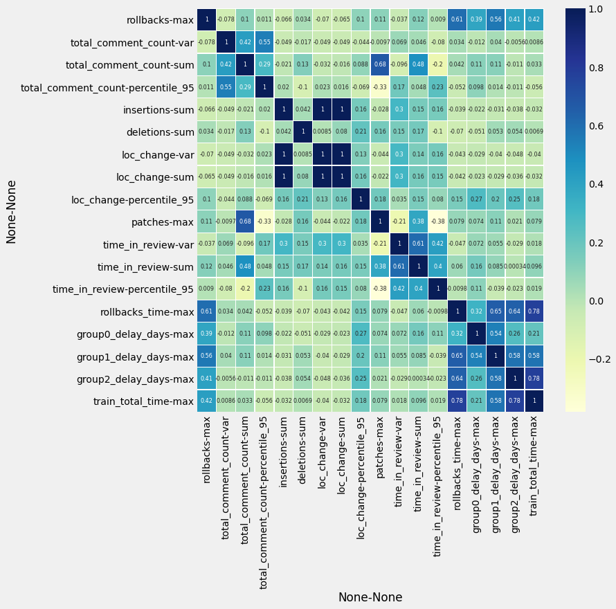

# Train Stats

```
 ----------------------------------------------------------------------------------------
/                                                                                        \
| /$$$$$$$$                 /$$            /$$$$$$   /$$                 /$$             |
||__  $$__/                |__/           /$$__  $$ | $$                | $$             |
|   | $$  /$$$$$$  /$$$$$$  /$$ /$$$$$$$ | $$  \__//$$$$$$    /$$$$$$  /$$$$$$   /$$$$$$$|
|   | $$ /$$__  $$|____  $$| $$| $$__  $$|  $$$$$$|_  $$_/   |____  $$|_  $$_/  /$$_____/|
|   | $$| $$  \__/ /$$$$$$$| $$| $$  \ $$ \____  $$ | $$      /$$$$$$$  | $$   |  $$$$$$ |
|   | $$| $$      /$$__  $$| $$| $$  | $$ /$$  \ $$ | $$ /$$ /$$__  $$  | $$ /$$\____  $$|
|   | $$| $$     |  $$$$$$$| $$| $$  | $$|  $$$$$$/ |  $$$$/|  $$$$$$$  |  $$$$//$$$$$$$/|
|   |__/|__/      \_______/|__/|__/  |__/ \______/   \___/   \_______/   \___/ |_______/ |
|                                                                                        |
|                                                                                        |
|                                                                                        |
|                                      🚂 ¯\_(ツ)_/¯?                                     |
\                                                                                        /
 ----------------------------------------------------------------------------------------
    \     
     \     
      \      
           ___ ____
         ⎛   ⎛ ,----
          \  //==--'
     _//|,.·//==--'    ____________________________
    _OO≣=-  ︶ ᴹw ⎞_§ ______  ___\ ___\ ,\__ \/ __ \
   (∞)_, )  (     |  ______/__  \/ /__ / /_/ / /_/ /
     ¨--¨|| |- (  / ______\____/ \___/ \__^_/  .__/
         ««_/  «_/ jgs/bd808                /_/
```

In which I look at data from the past several hundred trains and pretend that I know how to do exploratory data analysis.


```python
import pandas as pdb
from matplotlib import pyplot as plt
import seaborn as sns

import glob

# Makes your data 538% better...I think
plt.style.use('fivethirtyeight')

# ಠ_ಠ This is the rotten, no good, very bad way pandas makes you read csv files in a loop ಠ_ಠ
dfs = [pdb.read_csv(f'{train}') for train in glob.glob('data/*.csv')]
df = pdb.concat(dfs, axis=0, ignore_index=True)
```

# 🧐 Preliminary thinking

thinking....

Looking at the dataset desribed below it mostly looks correct. I note that the max of the `group[N]_delay_days` is `6` for every day and I'm doing some `N % 7` math somewhere on `.isoweekday()` so that's probably under-reporting. Overall the data looks ok. 👌


```python
df.describe()
```


<div>
<style scoped>
    .dataframe tbody tr th:only-of-type {
        vertical-align: middle;
    }

    .dataframe tbody tr th {
        vertical-align: top;
    }

    .dataframe thead th {
        text-align: right;
    }
</style>
<table border="1" class="dataframe">
  <thead>
    <tr style="text-align: right;">
      <th></th>
      <th>insertions</th>
      <th>deletions</th>
      <th>loc_change</th>
      <th>total_comment_count</th>
      <th>time_in_review</th>
      <th>patches</th>
      <th>rollbacks</th>
      <th>rollbacks_time</th>
      <th>group0_delay_days</th>
      <th>group1_delay_days</th>
      <th>group2_delay_days</th>
      <th>train_total_time</th>
    </tr>
  </thead>
  <tbody>
    <tr>
      <th>count</th>
      <td>5.725200e+04</td>
      <td>57252.000000</td>
      <td>5.725200e+04</td>
      <td>57252.000000</td>
      <td>5.725200e+04</td>
      <td>57252.000000</td>
      <td>57252.000000</td>
      <td>5.725200e+04</td>
      <td>57252.000000</td>
      <td>57252.000000</td>
      <td>57252.000000</td>
      <td>5.725200e+04</td>
    </tr>
    <tr>
      <th>mean</th>
      <td>4.261585e+02</td>
      <td>75.700989</td>
      <td>5.018595e+02</td>
      <td>3.151925</td>
      <td>9.348383e+05</td>
      <td>461.719241</td>
      <td>0.957958</td>
      <td>9.780326e+04</td>
      <td>0.469084</td>
      <td>0.910117</td>
      <td>1.176745</td>
      <td>2.839957e+05</td>
    </tr>
    <tr>
      <th>std</th>
      <td>7.230130e+04</td>
      <td>2453.631914</td>
      <td>7.242068e+04</td>
      <td>4.796869</td>
      <td>5.297748e+06</td>
      <td>183.902004</td>
      <td>1.070532</td>
      <td>1.816600e+05</td>
      <td>1.324611</td>
      <td>1.767145</td>
      <td>1.997625</td>
      <td>2.260752e+05</td>
    </tr>
    <tr>
      <th>min</th>
      <td>0.000000e+00</td>
      <td>0.000000</td>
      <td>0.000000e+00</td>
      <td>0.000000</td>
      <td>6.000000e+00</td>
      <td>172.000000</td>
      <td>0.000000</td>
      <td>0.000000e+00</td>
      <td>0.000000</td>
      <td>0.000000</td>
      <td>0.000000</td>
      <td>6.384400e+04</td>
    </tr>
    <tr>
      <th>25%</th>
      <td>2.000000e+00</td>
      <td>1.000000</td>
      <td>4.000000e+00</td>
      <td>1.000000</td>
      <td>3.830750e+03</td>
      <td>319.000000</td>
      <td>0.000000</td>
      <td>0.000000e+00</td>
      <td>0.000000</td>
      <td>0.000000</td>
      <td>0.000000</td>
      <td>1.723180e+05</td>
    </tr>
    <tr>
      <th>50%</th>
      <td>6.000000e+00</td>
      <td>4.000000</td>
      <td>1.200000e+01</td>
      <td>2.000000</td>
      <td>4.623350e+04</td>
      <td>410.000000</td>
      <td>1.000000</td>
      <td>4.011000e+03</td>
      <td>0.000000</td>
      <td>0.000000</td>
      <td>0.000000</td>
      <td>1.788110e+05</td>
    </tr>
    <tr>
      <th>75%</th>
      <td>3.000000e+01</td>
      <td>16.000000</td>
      <td>5.400000e+01</td>
      <td>4.000000</td>
      <td>3.298928e+05</td>
      <td>612.000000</td>
      <td>2.000000</td>
      <td>9.449300e+04</td>
      <td>0.000000</td>
      <td>1.000000</td>
      <td>1.000000</td>
      <td>2.550750e+05</td>
    </tr>
    <tr>
      <th>max</th>
      <td>1.728860e+07</td>
      <td>545717.000000</td>
      <td>1.728861e+07</td>
      <td>238.000000</td>
      <td>1.881695e+08</td>
      <td>969.000000</td>
      <td>4.000000</td>
      <td>1.167939e+06</td>
      <td>6.000000</td>
      <td>6.000000</td>
      <td>6.000000</td>
      <td>1.209310e+06</td>
    </tr>
  </tbody>
</table>
</div>


# 📑 Aggregation

There is 1×`csv`/train and each row is a patch that went out with that train. Information that is true for an **entire train** (like the _number of patches_, the _number of rollbacks_, the _train conductor_, etc) is **repeated** for every row. The data in the `csv` files is not normalized. It's like a "left join".

We need to aggregate differently per column. Some columns should be the `max`, others should be `sum`med.


```python
# from scipy import stats
import numpy

def percentile_95(x):
    return numpy.percentile(x, 95)

agg_df = df.groupby('version').agg({
#    'conductor': lambda x:stats.mode(x)[0],  # I don't know that I care about this…keeping it here to save me from looking at StackOverflow®™©
    'rollbacks': 'max',
    'total_comment_count': ['var', 'sum', percentile_95],
    'insertions': 'sum',
    'deletions': 'sum',
    'loc_change': ['var', 'sum', percentile_95],
    'patches': 'sum',
    'time_in_review': ['var', 'sum', percentile_95],
    'patches': 'max',
    'rollbacks_time': 'max',
    'group0_delay_days': 'max',
    'group1_delay_days': 'max',
    'group2_delay_days': 'max',
    'train_total_time': 'max',
})
agg_df.head()
```


<div>
<style scoped>
    .dataframe tbody tr th:only-of-type {
        vertical-align: middle;
    }

    .dataframe tbody tr th {
        vertical-align: top;
    }

    .dataframe thead tr th {
        text-align: left;
    }

    .dataframe thead tr:last-of-type th {
        text-align: right;
    }
</style>
<table border="1" class="dataframe">
  <thead>
    <tr>
      <th></th>
      <th>rollbacks</th>
      <th colspan="3" halign="left">total_comment_count</th>
      <th>insertions</th>
      <th>deletions</th>
      <th colspan="3" halign="left">loc_change</th>
      <th>patches</th>
      <th colspan="3" halign="left">time_in_review</th>
      <th>rollbacks_time</th>
      <th>group0_delay_days</th>
      <th>group1_delay_days</th>
      <th>group2_delay_days</th>
      <th>train_total_time</th>
    </tr>
    <tr>
      <th></th>
      <th>max</th>
      <th>var</th>
      <th>sum</th>
      <th>percentile_95</th>
      <th>sum</th>
      <th>sum</th>
      <th>var</th>
      <th>sum</th>
      <th>percentile_95</th>
      <th>max</th>
      <th>var</th>
      <th>sum</th>
      <th>percentile_95</th>
      <th>max</th>
      <th>max</th>
      <th>max</th>
      <th>max</th>
      <th>max</th>
    </tr>
    <tr>
      <th>version</th>
      <th></th>
      <th></th>
      <th></th>
      <th></th>
      <th></th>
      <th></th>
      <th></th>
      <th></th>
      <th></th>
      <th></th>
      <th></th>
      <th></th>
      <th></th>
      <th></th>
      <th></th>
      <th></th>
      <th></th>
      <th></th>
    </tr>
  </thead>
  <tbody>
    <tr>
      <th>1.31.0-wmf.1</th>
      <td>0</td>
      <td>14.504515</td>
      <td>1416</td>
      <td>11.00</td>
      <td>6364</td>
      <td>4758</td>
      <td>6.021532e+03</td>
      <td>11122</td>
      <td>122.20</td>
      <td>399</td>
      <td>1.212775e+13</td>
      <td>243850263.0</td>
      <td>1944153.70</td>
      <td>0</td>
      <td>0</td>
      <td>0</td>
      <td>0</td>
      <td>180742</td>
    </tr>
    <tr>
      <th>1.31.0-wmf.11</th>
      <td>1</td>
      <td>35.426994</td>
      <td>1799</td>
      <td>15.00</td>
      <td>77419</td>
      <td>68374</td>
      <td>3.162981e+07</td>
      <td>145793</td>
      <td>333.35</td>
      <td>335</td>
      <td>1.784497e+13</td>
      <td>222521732.0</td>
      <td>1931431.15</td>
      <td>5833</td>
      <td>0</td>
      <td>0</td>
      <td>0</td>
      <td>173546</td>
    </tr>
    <tr>
      <th>1.31.0-wmf.12</th>
      <td>0</td>
      <td>20.770749</td>
      <td>1307</td>
      <td>12.35</td>
      <td>8200</td>
      <td>4387</td>
      <td>1.124251e+04</td>
      <td>12587</td>
      <td>155.15</td>
      <td>374</td>
      <td>2.986819e+12</td>
      <td>102204853.0</td>
      <td>683185.25</td>
      <td>0</td>
      <td>0</td>
      <td>0</td>
      <td>0</td>
      <td>187456</td>
    </tr>
    <tr>
      <th>1.31.0-wmf.15</th>
      <td>0</td>
      <td>119.607756</td>
      <td>3887</td>
      <td>15.00</td>
      <td>42063</td>
      <td>31584</td>
      <td>2.069064e+05</td>
      <td>73647</td>
      <td>322.00</td>
      <td>756</td>
      <td>3.122607e+13</td>
      <td>554068249.0</td>
      <td>1518525.50</td>
      <td>0</td>
      <td>0</td>
      <td>0</td>
      <td>0</td>
      <td>188190</td>
    </tr>
    <tr>
      <th>1.31.0-wmf.16</th>
      <td>1</td>
      <td>65.291328</td>
      <td>1708</td>
      <td>18.00</td>
      <td>13006</td>
      <td>8376</td>
      <td>6.559969e+04</td>
      <td>21382</td>
      <td>290.65</td>
      <td>288</td>
      <td>4.485630e+12</td>
      <td>183990614.0</td>
      <td>3093578.10</td>
      <td>431612</td>
      <td>1</td>
      <td>6</td>
      <td>5</td>
      <td>562921</td>
    </tr>
  </tbody>
</table>
</div>


## I _think_ ☝️ looks 🌠

…carrying on then.

Below is the correlation between all the numeric data in our set.


```python
fig, ax = plt.subplots(figsize=(10,10))         # Sample figsize in inches
sns.heatmap(agg_df.corr(), annot=True, cmap="YlGnBu", linewidths=0.3, annot_kws={"size": 8}, ax=ax)
plt.xticks(rotation=90)
plt.yticks(rotation=0)
plt.show()
```


    

    


```python

```
