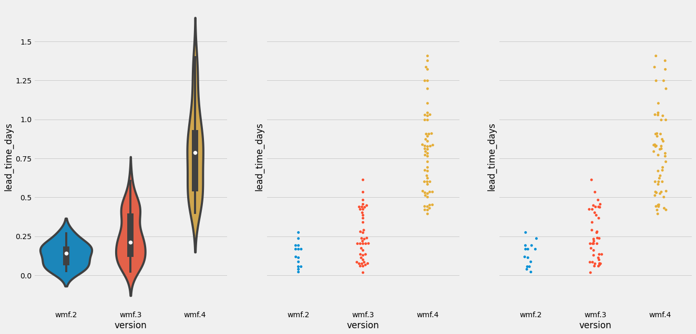
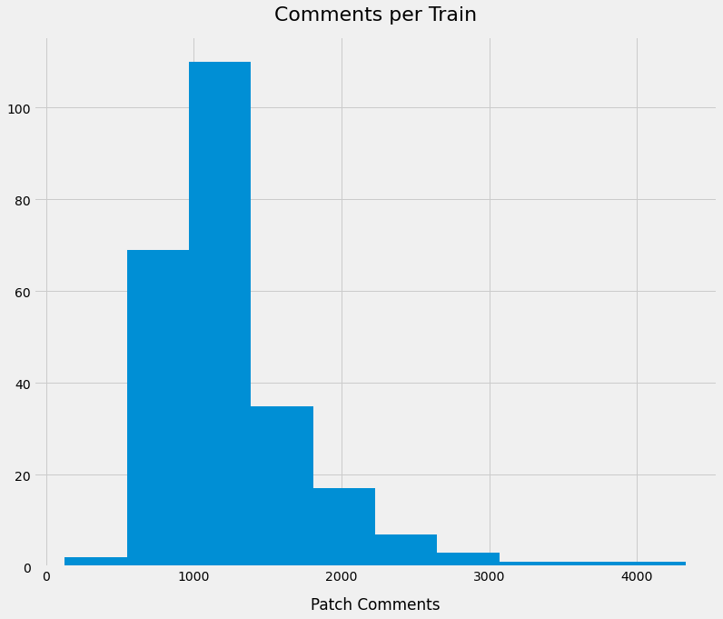
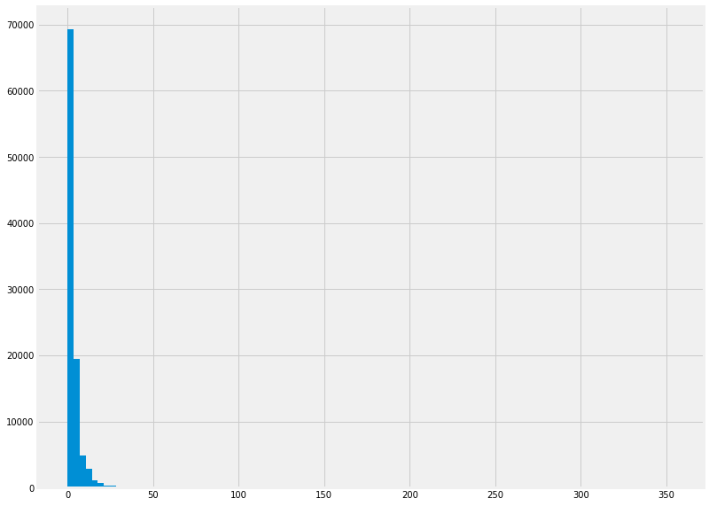

# Train Stats

```
 ----------------------------------------------------------------------------------------
/                                                                                        \
| /$$$$$$$$                 /$$            /$$$$$$   /$$                 /$$             |
||__  $$__/                |__/           /$$__  $$ | $$                | $$             |
|   | $$  /$$$$$$  /$$$$$$  /$$ /$$$$$$$ | $$  \__//$$$$$$    /$$$$$$  /$$$$$$   /$$$$$$$|
|   | $$ /$$__  $$|____  $$| $$| $$__  $$|  $$$$$$|_  $$_/   |____  $$|_  $$_/  /$$_____/|
|   | $$| $$  \__/ /$$$$$$$| $$| $$  \ $$ \____  $$ | $$      /$$$$$$$  | $$   |  $$$$$$ |
|   | $$| $$      /$$__  $$| $$| $$  | $$ /$$  \ $$ | $$ /$$ /$$__  $$  | $$ /$$\____  $$|
|   | $$| $$     |  $$$$$$$| $$| $$  | $$|  $$$$$$/ |  $$$$/|  $$$$$$$  |  $$$$//$$$$$$$/|
|   |__/|__/      \_______/|__/|__/  |__/ \______/   \___/   \_______/   \___/ |_______/ |
|                                                                                        |
|                                                                                        |
|                                                                                        |
|                                      🚂 ¯\_(ツ)_/¯?                                     |
\                                                                                        /
 ----------------------------------------------------------------------------------------
    \     
     \     
      \      
           ___ ____
         ⎛   ⎛ ,----
          \  //==--'
     _//|,.·//==--'    ____________________________
    _OO≣=-  ︶ ᴹw ⎞_§ ______  ___\ ___\ ,\__ \/ __ \
   (∞)_, )  (     |  ______/__  \/ /__ / /_/ / /_/ /
     ¨--¨|| |- (  / ______\____/ \___/ \__^_/  .__/
         ««_/  «_/ jgs/bd808                /_/
```

In which I look at data from the past several hundred trains and pretend that I know how to do exploratory data analysis.


```python
import pandas as pd
from matplotlib import pyplot as plt
import seaborn as sns

from sqlalchemy import create_engine
    
engine = create_engine('sqlite:///data/train.db')
df = pd.read_sql('''
SELECT
    version,
    rollbacks,
    rollbacks_time,
    group2_delay_days,
    (group0_delay_days +
     group1_delay_days +
     group2_delay_days) as total_delay,
    total_time as train_total_time,
    (select count(*) from blocker b where b.train_id = t.id) as blockers,
    (select count(*) from blocker b where b.train_id = t.id and resolved = 1) as resolved_blockers,
    patches,
    (select max(time_in_review) from patch p where p.train_id = t.id) as max_time_in_review,
    (select max(comments) from patch where patch.train_id = t.id) as max_comments_per_patch,
    (select max(start_time - created) from patch p where p.train_id = t.id) as max_cycle_time
FROM train t
''', engine)

# Makes your data 538% better...I think
plt.style.use('fivethirtyeight')
df.head()
```


<div>
<style scoped>
    .dataframe tbody tr th:only-of-type {
        vertical-align: middle;
    }

    .dataframe tbody tr th {
        vertical-align: top;
    }

    .dataframe thead th {
        text-align: right;
    }
</style>
<table border="1" class="dataframe">
  <thead>
    <tr style="text-align: right;">
      <th></th>
      <th>version</th>
      <th>rollbacks</th>
      <th>rollbacks_time</th>
      <th>group2_delay_days</th>
      <th>total_delay</th>
      <th>train_total_time</th>
      <th>blockers</th>
      <th>resolved_blockers</th>
      <th>patches</th>
      <th>max_time_in_review</th>
      <th>max_comments_per_patch</th>
      <th>max_cycle_time</th>
    </tr>
  </thead>
  <tbody>
    <tr>
      <th>0</th>
      <td>1.37.0-wmf.1</td>
      <td>0</td>
      <td>0</td>
      <td>0</td>
      <td>0</td>
      <td>178349</td>
      <td>5</td>
      <td>3</td>
      <td>450</td>
      <td>36809044.0</td>
      <td>27.0</td>
      <td>36952873.0</td>
    </tr>
    <tr>
      <th>1</th>
      <td>1.37.0-wmf.3</td>
      <td>3</td>
      <td>94493</td>
      <td>0</td>
      <td>1</td>
      <td>219880</td>
      <td>7</td>
      <td>6</td>
      <td>366</td>
      <td>56122286.0</td>
      <td>30.0</td>
      <td>56562620.0</td>
    </tr>
    <tr>
      <th>2</th>
      <td>1.37.0-wmf.4</td>
      <td>1</td>
      <td>66812</td>
      <td>1</td>
      <td>3</td>
      <td>263742</td>
      <td>9</td>
      <td>4</td>
      <td>422</td>
      <td>38820872.0</td>
      <td>29.0</td>
      <td>38982601.0</td>
    </tr>
    <tr>
      <th>3</th>
      <td>1.36.0-wmf.1</td>
      <td>0</td>
      <td>0</td>
      <td>4</td>
      <td>4</td>
      <td>519622</td>
      <td>1</td>
      <td>1</td>
      <td>566</td>
      <td>47181045.0</td>
      <td>31.0</td>
      <td>47755190.0</td>
    </tr>
    <tr>
      <th>4</th>
      <td>1.36.0-wmf.2</td>
      <td>4</td>
      <td>389769</td>
      <td>4</td>
      <td>5</td>
      <td>554704</td>
      <td>7</td>
      <td>1</td>
      <td>273</td>
      <td>110996452.0</td>
      <td>33.0</td>
      <td>111569626.0</td>
    </tr>
  </tbody>
</table>
</div>


```python
fig, ax = plt.subplots(figsize=(10,10))         # Sample figsize in inches
sns.heatmap(df.corr(), annot=True, cmap="YlGnBu", linewidths=0.3, annot_kws={"size": 8}, ax=ax)
plt.xticks(rotation=90)
plt.yticks(rotation=0)
plt.show()
```


    

    


```python
df.set_index('version')['blockers'].hist(figsize=(12, 10))
plt.xlabel("Blockers", labelpad=15)
plt.title("Blockers per Train", y=1.02, fontsize=22)
```


    Text(0.5, 1.02, 'Blockers per Train')


    

    


```python
df[df['blockers'] > 10].sort_values(by='blockers', ascending=False)
```


<div>
<style scoped>
    .dataframe tbody tr th:only-of-type {
        vertical-align: middle;
    }

    .dataframe tbody tr th {
        vertical-align: top;
    }

    .dataframe thead th {
        text-align: right;
    }
</style>
<table border="1" class="dataframe">
  <thead>
    <tr style="text-align: right;">
      <th></th>
      <th>version</th>
      <th>rollbacks</th>
      <th>rollbacks_time</th>
      <th>group2_delay_days</th>
      <th>total_delay</th>
      <th>train_total_time</th>
      <th>blockers</th>
      <th>resolved_blockers</th>
      <th>patches</th>
      <th>max_time_in_review</th>
      <th>max_comments_per_patch</th>
      <th>max_cycle_time</th>
    </tr>
  </thead>
  <tbody>
    <tr>
      <th>82</th>
      <td>1.34.0-wmf.20</td>
      <td>1</td>
      <td>16897</td>
      <td>5</td>
      <td>5</td>
      <td>600096</td>
      <td>20</td>
      <td>11</td>
      <td>413</td>
      <td>60583935.0</td>
      <td>37.0</td>
      <td>60715205.0</td>
    </tr>
    <tr>
      <th>242</th>
      <td>1.38.0-wmf.19</td>
      <td>1</td>
      <td>70250</td>
      <td>0</td>
      <td>1</td>
      <td>176801</td>
      <td>18</td>
      <td>10</td>
      <td>319</td>
      <td>85391889.0</td>
      <td>24.0</td>
      <td>85778365.0</td>
    </tr>
    <tr>
      <th>103</th>
      <td>1.33.0-wmf.22</td>
      <td>0</td>
      <td>0</td>
      <td>0</td>
      <td>1</td>
      <td>63844</td>
      <td>17</td>
      <td>11</td>
      <td>391</td>
      <td>107411197.0</td>
      <td>45.0</td>
      <td>107659715.0</td>
    </tr>
    <tr>
      <th>77</th>
      <td>1.34.0-wmf.14</td>
      <td>2</td>
      <td>412678</td>
      <td>4</td>
      <td>5</td>
      <td>524983</td>
      <td>16</td>
      <td>7</td>
      <td>646</td>
      <td>73502579.0</td>
      <td>34.0</td>
      <td>73539481.0</td>
    </tr>
    <tr>
      <th>136</th>
      <td>1.31.0-wmf.20</td>
      <td>2</td>
      <td>134534</td>
      <td>1</td>
      <td>5</td>
      <td>255075</td>
      <td>14</td>
      <td>12</td>
      <td>822</td>
      <td>66099647.0</td>
      <td>75.0</td>
      <td>67210868.0</td>
    </tr>
    <tr>
      <th>210</th>
      <td>1.30.0-wmf.2</td>
      <td>2</td>
      <td>595079</td>
      <td>0</td>
      <td>0</td>
      <td>782668</td>
      <td>14</td>
      <td>12</td>
      <td>462</td>
      <td>67958577.0</td>
      <td>56.0</td>
      <td>68943029.0</td>
    </tr>
    <tr>
      <th>241</th>
      <td>1.38.0-wmf.18</td>
      <td>0</td>
      <td>0</td>
      <td>0</td>
      <td>0</td>
      <td>171956</td>
      <td>13</td>
      <td>7</td>
      <td>287</td>
      <td>186407187.0</td>
      <td>43.0</td>
      <td>186862129.0</td>
    </tr>
    <tr>
      <th>124</th>
      <td>1.32.0-wmf.22</td>
      <td>0</td>
      <td>0</td>
      <td>0</td>
      <td>0</td>
      <td>173055</td>
      <td>12</td>
      <td>7</td>
      <td>824</td>
      <td>64869761.0</td>
      <td>44.0</td>
      <td>65392036.0</td>
    </tr>
    <tr>
      <th>57</th>
      <td>1.35.0-wmf.31</td>
      <td>3</td>
      <td>365118</td>
      <td>4</td>
      <td>15</td>
      <td>516489</td>
      <td>11</td>
      <td>7</td>
      <td>427</td>
      <td>72215548.0</td>
      <td>70.0</td>
      <td>72206585.0</td>
    </tr>
    <tr>
      <th>76</th>
      <td>1.34.0-wmf.13</td>
      <td>2</td>
      <td>14912</td>
      <td>0</td>
      <td>1</td>
      <td>183853</td>
      <td>11</td>
      <td>8</td>
      <td>471</td>
      <td>53208155.0</td>
      <td>23.0</td>
      <td>53820019.0</td>
    </tr>
    <tr>
      <th>187</th>
      <td>1.28.0-wmf.21</td>
      <td>1</td>
      <td>88476</td>
      <td>0</td>
      <td>1</td>
      <td>176082</td>
      <td>11</td>
      <td>8</td>
      <td>514</td>
      <td>60386455.0</td>
      <td>93.0</td>
      <td>61360331.0</td>
    </tr>
  </tbody>
</table>
</div>


```python
block_df = pd.read_sql('''
SELECT
    version,
    group_blocked
FROM train t
JOIN blocker b ON t.id = b.train_id
''', engine)
block_df.head()
```


<div>
<style scoped>
    .dataframe tbody tr th:only-of-type {
        vertical-align: middle;
    }

    .dataframe tbody tr th {
        vertical-align: top;
    }

    .dataframe thead th {
        text-align: right;
    }
</style>
<table border="1" class="dataframe">
  <thead>
    <tr style="text-align: right;">
      <th></th>
      <th>version</th>
      <th>group_blocked</th>
    </tr>
  </thead>
  <tbody>
    <tr>
      <th>0</th>
      <td>1.37.0-wmf.7</td>
      <td>-1</td>
    </tr>
    <tr>
      <th>1</th>
      <td>1.37.0-wmf.7</td>
      <td>-1</td>
    </tr>
    <tr>
      <th>2</th>
      <td>1.37.0-wmf.12</td>
      <td>2</td>
    </tr>
    <tr>
      <th>3</th>
      <td>1.37.0-wmf.12</td>
      <td>1</td>
    </tr>
    <tr>
      <th>4</th>
      <td>1.37.0-wmf.12</td>
      <td>1</td>
    </tr>
  </tbody>
</table>
</div>


```python
block_df.group_blocked.unique()
```


    array([-1,  2,  1,  0])


```python
group_name_map = {
    -1: "Earlier",
    0: "Group0",
    1: "Group1",
    2: "Group2",
}
block_df['blocker_added'] = block_df.group_blocked.map(group_name_map)
block_df.head()
```


<div>
<style scoped>
    .dataframe tbody tr th:only-of-type {
        vertical-align: middle;
    }

    .dataframe tbody tr th {
        vertical-align: top;
    }

    .dataframe thead th {
        text-align: right;
    }
</style>
<table border="1" class="dataframe">
  <thead>
    <tr style="text-align: right;">
      <th></th>
      <th>version</th>
      <th>group_blocked</th>
      <th>blocker_added</th>
    </tr>
  </thead>
  <tbody>
    <tr>
      <th>0</th>
      <td>1.37.0-wmf.7</td>
      <td>-1</td>
      <td>Earlier</td>
    </tr>
    <tr>
      <th>1</th>
      <td>1.37.0-wmf.7</td>
      <td>-1</td>
      <td>Earlier</td>
    </tr>
    <tr>
      <th>2</th>
      <td>1.37.0-wmf.12</td>
      <td>2</td>
      <td>Group2</td>
    </tr>
    <tr>
      <th>3</th>
      <td>1.37.0-wmf.12</td>
      <td>1</td>
      <td>Group1</td>
    </tr>
    <tr>
      <th>4</th>
      <td>1.37.0-wmf.12</td>
      <td>1</td>
      <td>Group1</td>
    </tr>
  </tbody>
</table>
</div>


```python
block_df.group_blocked.value_counts()
```


    -1    380
     1    335
     0    269
     2    123
    Name: group_blocked, dtype: int64


```python
block_df.version
```


    0        1.37.0-wmf.7
    1        1.37.0-wmf.7
    2       1.37.0-wmf.12
    3       1.37.0-wmf.12
    4       1.37.0-wmf.12
                ...      
    1102    1.38.0-wmf.20
    1103    1.38.0-wmf.21
    1104    1.38.0-wmf.21
    1105    1.38.0-wmf.21
    1106    1.38.0-wmf.21
    Name: version, Length: 1107, dtype: object


```python
block_df.set_index('version')
block_df.sort_values('group_blocked', inplace=True)


fig = plt.figure(figsize=(16,6))
plt.grid(color='white', lw=0.5, axis='x')
n, bins, patches = plt.hist(block_df.blocker_added, bins=4, rwidth=0.95)

xticks = [(bins[idx+1] + value)/2 for idx, value in enumerate(bins[:-1])]
xticks_labels = [ "{:.2f}\nto\n{:.2f}".format(value, bins[idx+1]) for idx, value in enumerate(bins[:-1])]
plt.xticks(xticks, labels=["Before group0", "Group0", "Group1", "Group2"])

# remove y ticks
plt.yticks([])

# plot values on top of bars
for idx, value in enumerate(n):
    if value > 0:
        plt.text(xticks[idx], value+5, int(value), ha='center')

plt.title('Train Blockers by Group Where They Were Discovered', loc='left', pad=30)
plt.show()

```


    

    


```python
patches = pd.read_sql('''
SELECT
    link,
    version,
    submitted,
    insertions as ins,
    (deletions*-1) as del
FROM patch p JOIN train t ON t.id = p.train_id
''', engine)
patches.describe()
```


<div>
<style scoped>
    .dataframe tbody tr th:only-of-type {
        vertical-align: middle;
    }

    .dataframe tbody tr th {
        vertical-align: top;
    }

    .dataframe thead th {
        text-align: right;
    }
</style>
<table border="1" class="dataframe">
  <thead>
    <tr style="text-align: right;">
      <th></th>
      <th>submitted</th>
      <th>ins</th>
      <th>del</th>
    </tr>
  </thead>
  <tbody>
    <tr>
      <th>count</th>
      <td>8.416700e+04</td>
      <td>8.416700e+04</td>
      <td>8.416700e+04</td>
    </tr>
    <tr>
      <th>mean</th>
      <td>1.555413e+09</td>
      <td>3.606297e+02</td>
      <td>-2.854380e+02</td>
    </tr>
    <tr>
      <th>std</th>
      <td>5.040998e+07</td>
      <td>5.981384e+04</td>
      <td>5.734371e+04</td>
    </tr>
    <tr>
      <th>min</th>
      <td>1.431572e+09</td>
      <td>0.000000e+00</td>
      <td>-1.661412e+07</td>
    </tr>
    <tr>
      <th>25%</th>
      <td>1.518575e+09</td>
      <td>2.000000e+00</td>
      <td>-1.600000e+01</td>
    </tr>
    <tr>
      <th>50%</th>
      <td>1.559672e+09</td>
      <td>6.000000e+00</td>
      <td>-4.000000e+00</td>
    </tr>
    <tr>
      <th>75%</th>
      <td>1.594293e+09</td>
      <td>3.000000e+01</td>
      <td>-1.000000e+00</td>
    </tr>
    <tr>
      <th>max</th>
      <td>1.644312e+09</td>
      <td>1.728860e+07</td>
      <td>0.000000e+00</td>
    </tr>
  </tbody>
</table>
</div>


```python
patches['loc'] = patches['ins'] + patches['del']
patches.head()
```


<div>
<style scoped>
    .dataframe tbody tr th:only-of-type {
        vertical-align: middle;
    }

    .dataframe tbody tr th {
        vertical-align: top;
    }

    .dataframe thead th {
        text-align: right;
    }
</style>
<table border="1" class="dataframe">
  <thead>
    <tr style="text-align: right;">
      <th></th>
      <th>link</th>
      <th>version</th>
      <th>submitted</th>
      <th>ins</th>
      <th>del</th>
      <th>loc</th>
    </tr>
  </thead>
  <tbody>
    <tr>
      <th>0</th>
      <td>https://gerrit.wikimedia.org/r/#/q/ccbfcf28,n,z</td>
      <td>1.37.0-wmf.1</td>
      <td>1618945759</td>
      <td>5</td>
      <td>-1</td>
      <td>4</td>
    </tr>
    <tr>
      <th>1</th>
      <td>https://gerrit.wikimedia.org/r/#/q/3302274f,n,z</td>
      <td>1.37.0-wmf.1</td>
      <td>1618878371</td>
      <td>1156</td>
      <td>-660</td>
      <td>496</td>
    </tr>
    <tr>
      <th>2</th>
      <td>https://gerrit.wikimedia.org/r/#/q/8b5471b5,n,z</td>
      <td>1.37.0-wmf.1</td>
      <td>1618343309</td>
      <td>976</td>
      <td>-3</td>
      <td>973</td>
    </tr>
    <tr>
      <th>3</th>
      <td>https://gerrit.wikimedia.org/r/#/q/a6abbb67,n,z</td>
      <td>1.37.0-wmf.1</td>
      <td>1618341075</td>
      <td>8</td>
      <td>-29</td>
      <td>-21</td>
    </tr>
    <tr>
      <th>4</th>
      <td>https://gerrit.wikimedia.org/r/#/q/af916aad,n,z</td>
      <td>1.37.0-wmf.1</td>
      <td>1618300868</td>
      <td>7</td>
      <td>-5</td>
      <td>2</td>
    </tr>
  </tbody>
</table>
</div>


```python
patches['submitted'] = pd.to_datetime(patches['submitted'], unit='s')
patches.set_index('submitted', inplace=True)
```


```python
out = patches.groupby(pd.Grouper(freq='M')).apply(lambda x: x)
out = out[out['link'] != 'https://gerrit.wikimedia.org/r/#/q/9a08dbab,n,z'] # The one patch that inserts 17.2M lines of code
out['ok'] = out['loc'].cumsum()
```

## Cycle time/Lead time

**Cycle time** is the time from when a patch enters code review to the time that it's in production. **Lead time** is the time it takes from commit to production.


```python
# GOAL
#         train     lead_time    cycle_time   Id
# 0    1.37.0-wmf.6    200   2000   u1234
# 1    1.37.0-wmf.6    123   2800   u1235

cycle = pd.read_sql('''
SELECT
    substr(version, 8) as version,
    datetime(start_time, 'unixepoch'),
    (start_time - created) as cycle_time,
    (start_time - submitted) as lead_time,
    datetime(created, 'unixepoch'),
    datetime(submitted, 'unixepoch'),
    link
FROM patch p JOIN train t ON t.id = p.train_id
WHERE (lead_time > 0 AND cycle_time > 0)
    AND (
        version = '1.38.0-wmf.19' OR
        version = '1.38.0-wmf.20' OR
        version = '1.38.0-wmf.21'
    )
''', engine)
cycle.head()
```


<div>
<style scoped>
    .dataframe tbody tr th:only-of-type {
        vertical-align: middle;
    }

    .dataframe tbody tr th {
        vertical-align: top;
    }

    .dataframe thead th {
        text-align: right;
    }
</style>
<table border="1" class="dataframe">
  <thead>
    <tr style="text-align: right;">
      <th></th>
      <th>version</th>
      <th>datetime(start_time, 'unixepoch')</th>
      <th>cycle_time</th>
      <th>lead_time</th>
      <th>datetime(created, 'unixepoch')</th>
      <th>datetime(submitted, 'unixepoch')</th>
      <th>link</th>
    </tr>
  </thead>
  <tbody>
    <tr>
      <th>0</th>
      <td>wmf.19</td>
      <td>2022-01-25 18:57:28</td>
      <td>35422</td>
      <td>34495</td>
      <td>2022-01-25 09:07:06</td>
      <td>2022-01-25 09:22:33</td>
      <td>https://gerrit.wikimedia.org/r/q/756746</td>
    </tr>
    <tr>
      <th>1</th>
      <td>wmf.19</td>
      <td>2022-01-25 18:57:28</td>
      <td>4725797</td>
      <td>53881</td>
      <td>2021-12-02 02:14:11</td>
      <td>2022-01-25 03:59:27</td>
      <td>https://gerrit.wikimedia.org/r/q/742994</td>
    </tr>
    <tr>
      <th>2</th>
      <td>wmf.19</td>
      <td>2022-01-25 18:57:28</td>
      <td>4805938</td>
      <td>106571</td>
      <td>2021-12-01 03:58:30</td>
      <td>2022-01-24 13:21:17</td>
      <td>https://gerrit.wikimedia.org/r/q/742801</td>
    </tr>
    <tr>
      <th>3</th>
      <td>wmf.19</td>
      <td>2022-01-25 18:57:28</td>
      <td>673214</td>
      <td>44428</td>
      <td>2022-01-17 23:57:14</td>
      <td>2022-01-25 06:37:00</td>
      <td>https://gerrit.wikimedia.org/r/q/754546</td>
    </tr>
    <tr>
      <th>4</th>
      <td>wmf.19</td>
      <td>2022-01-25 18:57:28</td>
      <td>113450</td>
      <td>81917</td>
      <td>2022-01-24 11:26:38</td>
      <td>2022-01-24 20:12:11</td>
      <td>https://gerrit.wikimedia.org/r/q/756187</td>
    </tr>
  </tbody>
</table>
</div>


```python
cycle.sort_values(by='lead_time', ascending=False).head()
```


<div>
<style scoped>
    .dataframe tbody tr th:only-of-type {
        vertical-align: middle;
    }

    .dataframe tbody tr th {
        vertical-align: top;
    }

    .dataframe thead th {
        text-align: right;
    }
</style>
<table border="1" class="dataframe">
  <thead>
    <tr style="text-align: right;">
      <th></th>
      <th>version</th>
      <th>datetime(start_time, 'unixepoch')</th>
      <th>cycle_time</th>
      <th>lead_time</th>
      <th>datetime(created, 'unixepoch')</th>
      <th>datetime(submitted, 'unixepoch')</th>
      <th>link</th>
    </tr>
  </thead>
  <tbody>
    <tr>
      <th>648</th>
      <td>wmf.20</td>
      <td>2022-02-01 19:19:48</td>
      <td>674854</td>
      <td>641818</td>
      <td>2022-01-24 23:52:14</td>
      <td>2022-01-25 09:02:50</td>
      <td>https://gerrit.wikimedia.org/r/q/756629</td>
    </tr>
    <tr>
      <th>649</th>
      <td>wmf.20</td>
      <td>2022-02-01 19:19:48</td>
      <td>653404</td>
      <td>640817</td>
      <td>2022-01-25 05:49:44</td>
      <td>2022-01-25 09:19:31</td>
      <td>https://gerrit.wikimedia.org/r/q/756716</td>
    </tr>
    <tr>
      <th>516</th>
      <td>wmf.20</td>
      <td>2022-02-01 19:19:48</td>
      <td>982874</td>
      <td>640564</td>
      <td>2022-01-21 10:18:34</td>
      <td>2022-01-25 09:23:44</td>
      <td>https://gerrit.wikimedia.org/r/q/755842</td>
    </tr>
    <tr>
      <th>408</th>
      <td>wmf.20</td>
      <td>2022-02-01 19:19:48</td>
      <td>640558</td>
      <td>640231</td>
      <td>2022-01-25 09:23:50</td>
      <td>2022-01-25 09:29:17</td>
      <td>https://gerrit.wikimedia.org/r/q/756748</td>
    </tr>
    <tr>
      <th>299</th>
      <td>wmf.19</td>
      <td>2022-01-25 18:57:28</td>
      <td>934079</td>
      <td>637651</td>
      <td>2022-01-14 23:29:29</td>
      <td>2022-01-18 09:49:57</td>
      <td>https://gerrit.wikimedia.org/r/q/753990</td>
    </tr>
  </tbody>
</table>
</div>


### Lead time

The time from commit to deploy (in seconds)


```python
cycle['lead_time_days'] = cycle['lead_time'] / (60*60*24)
cycle['cycle_time_days'] = cycle['cycle_time'] / (60*60*24)
cycle.sort_values(by='lead_time_days').head()
```


<div>
<style scoped>
    .dataframe tbody tr th:only-of-type {
        vertical-align: middle;
    }

    .dataframe tbody tr th {
        vertical-align: top;
    }

    .dataframe thead th {
        text-align: right;
    }
</style>
<table border="1" class="dataframe">
  <thead>
    <tr style="text-align: right;">
      <th></th>
      <th>version</th>
      <th>datetime(start_time, 'unixepoch')</th>
      <th>cycle_time</th>
      <th>lead_time</th>
      <th>datetime(created, 'unixepoch')</th>
      <th>datetime(submitted, 'unixepoch')</th>
      <th>link</th>
      <th>lead_time_days</th>
      <th>cycle_time_days</th>
    </tr>
  </thead>
  <tbody>
    <tr>
      <th>665</th>
      <td>wmf.21</td>
      <td>2022-02-08 18:29:03</td>
      <td>33702</td>
      <td>32856</td>
      <td>2022-02-08 09:07:21</td>
      <td>2022-02-08 09:21:27</td>
      <td>https://gerrit.wikimedia.org/r/q/760693</td>
      <td>0.380278</td>
      <td>0.390069</td>
    </tr>
    <tr>
      <th>0</th>
      <td>wmf.19</td>
      <td>2022-01-25 18:57:28</td>
      <td>35422</td>
      <td>34495</td>
      <td>2022-01-25 09:07:06</td>
      <td>2022-01-25 09:22:33</td>
      <td>https://gerrit.wikimedia.org/r/q/756746</td>
      <td>0.399248</td>
      <td>0.409977</td>
    </tr>
    <tr>
      <th>870</th>
      <td>wmf.21</td>
      <td>2022-02-08 18:29:03</td>
      <td>462473</td>
      <td>35055</td>
      <td>2022-02-03 10:01:10</td>
      <td>2022-02-08 08:44:48</td>
      <td>https://gerrit.wikimedia.org/r/q/759311</td>
      <td>0.405729</td>
      <td>5.352697</td>
    </tr>
    <tr>
      <th>319</th>
      <td>wmf.20</td>
      <td>2022-02-01 19:19:48</td>
      <td>36761</td>
      <td>35891</td>
      <td>2022-02-01 09:07:07</td>
      <td>2022-02-01 09:21:37</td>
      <td>https://gerrit.wikimedia.org/r/q/758593</td>
      <td>0.415405</td>
      <td>0.425475</td>
    </tr>
    <tr>
      <th>762</th>
      <td>wmf.21</td>
      <td>2022-02-08 18:29:03</td>
      <td>68587</td>
      <td>36673</td>
      <td>2022-02-07 23:25:56</td>
      <td>2022-02-08 08:17:50</td>
      <td>https://gerrit.wikimedia.org/r/q/760602</td>
      <td>0.424456</td>
      <td>0.793831</td>
    </tr>
  </tbody>
</table>
</div>


```python
from matplotlib import ticker as mticker
import numpy as np

# Adapted from <https://stackoverflow.com/a/60132262>
fig, ax = plt.subplots(1, 3, sharey=True, figsize=(20,10))
sns.violinplot(data=cycle,x='version', y='lead_time_days', ax=ax[0])
sns.swarmplot(data=cycle,x='version', y='lead_time_days', ax=ax[1])
sns.stripplot(data=cycle,x='version', y='lead_time_days', ax=ax[2])
ax[0].yaxis.set_major_formatter(mticker.StrMethodFormatter("{x}"))
plt.show()
```


    

    


### Cycle time

The time from patchset submission for code review to deploy


```python
from matplotlib import ticker as mticker
import numpy as np

# Adapted from <https://stackoverflow.com/a/60132262>
fig, ax = plt.subplots(1, 3, sharey=True, figsize=(20,10))
sns.violinplot(data=cycle,x='version', y='cycle_time_days', ax=ax[0])
sns.swarmplot(data=cycle,x='version', y='cycle_time_days', ax=ax[1])
sns.stripplot(data=cycle,x='version', y='cycle_time_days', ax=ax[2])
ax[0].yaxis.set_major_formatter(mticker.StrMethodFormatter("{x}"))
plt.show()
```

    /usr/lib/python3/dist-packages/seaborn/categorical.py:1296: UserWarning: 73.0% of the points cannot be placed; you may want to decrease the size of the markers or use stripplot.
      warnings.warn(msg, UserWarning)
    /usr/lib/python3/dist-packages/seaborn/categorical.py:1296: UserWarning: 74.9% of the points cannot be placed; you may want to decrease the size of the markers or use stripplot.
      warnings.warn(msg, UserWarning)
    /usr/lib/python3/dist-packages/seaborn/categorical.py:1296: UserWarning: 77.1% of the points cannot be placed; you may want to decrease the size of the markers or use stripplot.
      warnings.warn(msg, UserWarning)


    

    


## Train bugfixes

> **Backport**
> * v. To retroactively supply a fix, or a new feature, to a previous version of a software product at the same time (or after) supplying it to the current version.
> * n. A commit that is backported

Each train has many backports. Each backport may be supplied to many trains. Backports add features, change feature flags, and fix bugs.

Some backports have tasks associated with them. Some tasks are "bugs" or "errors".

When a backport is associated with a task that is a "bug" or an "error" it's a bugfix. The number of bugfixes per train is a good signal of the number of bugs that were present in that train.

Bugs may persist for many trains; however, if a developer makes a backport, they felt that the bug was severe enough to warrant fixing immediately rather than waiting a week—that's signal about train quality, too.


```python
train_bugs = pd.read_sql('''
select
  version,
  count(b.link) as bug_count
from
  train t
  join bug_train bt on bt.train_id = t.id
  join bug b on bt.bug_id = b.id
group by
  version
order by
  start_time
''', engine)
train_bugs.head()
```


<div>
<style scoped>
    .dataframe tbody tr th:only-of-type {
        vertical-align: middle;
    }

    .dataframe tbody tr th {
        vertical-align: top;
    }

    .dataframe thead th {
        text-align: right;
    }
</style>
<table border="1" class="dataframe">
  <thead>
    <tr style="text-align: right;">
      <th></th>
      <th>version</th>
      <th>bug_count</th>
    </tr>
  </thead>
  <tbody>
    <tr>
      <th>0</th>
      <td>1.27.0-wmf.16</td>
      <td>3</td>
    </tr>
    <tr>
      <th>1</th>
      <td>1.27.0-wmf.19</td>
      <td>1</td>
    </tr>
    <tr>
      <th>2</th>
      <td>1.27.0-wmf.21</td>
      <td>1</td>
    </tr>
    <tr>
      <th>3</th>
      <td>1.27.0-wmf.22</td>
      <td>2</td>
    </tr>
    <tr>
      <th>4</th>
      <td>1.27.0-wmf.23</td>
      <td>3</td>
    </tr>
  </tbody>
</table>
</div>


### Bug count histogram

Seems to follow the power law


```python
train_bugs.hist()
```


    array([[<AxesSubplot:title={'center':'bug_count'}>]], dtype=object)


    

    


```python
train_bugs.sort_values(by="bug_count", ascending=False).head()
```


<div>
<style scoped>
    .dataframe tbody tr th:only-of-type {
        vertical-align: middle;
    }

    .dataframe tbody tr th {
        vertical-align: top;
    }

    .dataframe thead th {
        text-align: right;
    }
</style>
<table border="1" class="dataframe">
  <thead>
    <tr style="text-align: right;">
      <th></th>
      <th>version</th>
      <th>bug_count</th>
    </tr>
  </thead>
  <tbody>
    <tr>
      <th>120</th>
      <td>1.34.0-wmf.13</td>
      <td>13</td>
    </tr>
    <tr>
      <th>194</th>
      <td>1.37.0-wmf.5</td>
      <td>11</td>
    </tr>
    <tr>
      <th>90</th>
      <td>1.32.0-wmf.24</td>
      <td>11</td>
    </tr>
    <tr>
      <th>119</th>
      <td>1.34.0-wmf.11</td>
      <td>11</td>
    </tr>
    <tr>
      <th>206</th>
      <td>1.37.0-wmf.20</td>
      <td>11</td>
    </tr>
  </tbody>
</table>
</div>


```python
train_bugs = pd.read_sql('''
select
  version,
  count(b.link) as bug_count,
  rollbacks,
  (select count(*) from blocker b where b.train_id = t.id and resolved = 1) as resolved_blockers,
      (select max(time_in_review) from patch p where p.train_id = t.id) as max_time_in_review,
    (select max(comments) from patch where patch.train_id = t.id) as max_comments_per_patch,
    (select max(start_time - created) from patch p where p.train_id = t.id) as max_cycle_time,
  patches
from
  train t
  join bug_train bt on bt.train_id = t.id
  join bug b on bt.bug_id = b.id
group by
  version
order by
  start_time
''', engine)
train_bugs.head()
```


<div>
<style scoped>
    .dataframe tbody tr th:only-of-type {
        vertical-align: middle;
    }

    .dataframe tbody tr th {
        vertical-align: top;
    }

    .dataframe thead th {
        text-align: right;
    }
</style>
<table border="1" class="dataframe">
  <thead>
    <tr style="text-align: right;">
      <th></th>
      <th>version</th>
      <th>bug_count</th>
      <th>rollbacks</th>
      <th>resolved_blockers</th>
      <th>max_time_in_review</th>
      <th>max_comments_per_patch</th>
      <th>max_cycle_time</th>
      <th>patches</th>
    </tr>
  </thead>
  <tbody>
    <tr>
      <th>0</th>
      <td>1.27.0-wmf.16</td>
      <td>3</td>
      <td>1</td>
      <td>0</td>
      <td>17557313.0</td>
      <td>95.0</td>
      <td>18128243.0</td>
      <td>322</td>
    </tr>
    <tr>
      <th>1</th>
      <td>1.27.0-wmf.19</td>
      <td>1</td>
      <td>1</td>
      <td>1</td>
      <td>58248774.0</td>
      <td>45.0</td>
      <td>58798558.0</td>
      <td>230</td>
    </tr>
    <tr>
      <th>2</th>
      <td>1.27.0-wmf.21</td>
      <td>1</td>
      <td>0</td>
      <td>0</td>
      <td>120956985.0</td>
      <td>73.0</td>
      <td>120937246.0</td>
      <td>180</td>
    </tr>
    <tr>
      <th>3</th>
      <td>1.27.0-wmf.22</td>
      <td>2</td>
      <td>0</td>
      <td>0</td>
      <td>50045244.0</td>
      <td>58.0</td>
      <td>50160003.0</td>
      <td>416</td>
    </tr>
    <tr>
      <th>4</th>
      <td>1.27.0-wmf.23</td>
      <td>3</td>
      <td>2</td>
      <td>3</td>
      <td>20153065.0</td>
      <td>40.0</td>
      <td>20228209.0</td>
      <td>168</td>
    </tr>
  </tbody>
</table>
</div>


```python
fig, ax = plt.subplots(figsize=(10,10))         # Sample figsize in inches
sns.heatmap(train_bugs.corr(), annot=True, cmap="YlGnBu", linewidths=0.3, annot_kws={"size": 8}, ax=ax)
plt.xticks(rotation=90)
plt.yticks(rotation=0)
plt.show()
```


    

    


```python
train_bugs[train_bugs['version'] == '1.38.0-wmf.21']
```


<div>
<style scoped>
    .dataframe tbody tr th:only-of-type {
        vertical-align: middle;
    }

    .dataframe tbody tr th {
        vertical-align: top;
    }

    .dataframe thead th {
        text-align: right;
    }
</style>
<table border="1" class="dataframe">
  <thead>
    <tr style="text-align: right;">
      <th></th>
      <th>version</th>
      <th>bug_count</th>
      <th>rollbacks</th>
      <th>resolved_blockers</th>
      <th>max_time_in_review</th>
      <th>max_comments_per_patch</th>
      <th>max_cycle_time</th>
      <th>patches</th>
    </tr>
  </thead>
  <tbody>
    <tr>
      <th>224</th>
      <td>1.38.0-wmf.21</td>
      <td>2</td>
      <td>0</td>
      <td>3</td>
      <td>67000092.0</td>
      <td>38.0</td>
      <td>67130228.0</td>
      <td>293</td>
    </tr>
  </tbody>
</table>
</div>


## A look at comments per patch

DCaro made an interesting comment on the [the fame blog](https://phabricator.wikimedia.org/phame/post/view/272/diving_into_our_deployment_data/#4166) about this repo. This is my ham-fisted investigation.


```python
comm_dist = pd.read_sql('select version, sum(comments) as comm from patch p join train t on p.train_id = t.id group by t.version', engine)
comm_dist.head()
```


<div>
<style scoped>
    .dataframe tbody tr th:only-of-type {
        vertical-align: middle;
    }

    .dataframe tbody tr th {
        vertical-align: top;
    }

    .dataframe thead th {
        text-align: right;
    }
</style>
<table border="1" class="dataframe">
  <thead>
    <tr style="text-align: right;">
      <th></th>
      <th>version</th>
      <th>comm</th>
    </tr>
  </thead>
  <tbody>
    <tr>
      <th>0</th>
      <td>1.27.0-wmf.16</td>
      <td>1840</td>
    </tr>
    <tr>
      <th>1</th>
      <td>1.27.0-wmf.17</td>
      <td>1372</td>
    </tr>
    <tr>
      <th>2</th>
      <td>1.27.0-wmf.18</td>
      <td>1204</td>
    </tr>
    <tr>
      <th>3</th>
      <td>1.27.0-wmf.19</td>
      <td>1440</td>
    </tr>
    <tr>
      <th>4</th>
      <td>1.27.0-wmf.20</td>
      <td>1573</td>
    </tr>
  </tbody>
</table>
</div>


```python
comm_dist.set_index('version')['comm'].hist(figsize=(12, 10))
plt.xlabel("Patch Comments", labelpad=15)
plt.title("Comments per Train", y=1.02, fontsize=22)
```


    Text(0.5, 1.02, 'Comments per Train')


    

    


```python
pcommdf = pd.read_sql('select link, comments from patch', engine)
pcommdf.head()
```


<div>
<style scoped>
    .dataframe tbody tr th:only-of-type {
        vertical-align: middle;
    }

    .dataframe tbody tr th {
        vertical-align: top;
    }

    .dataframe thead th {
        text-align: right;
    }
</style>
<table border="1" class="dataframe">
  <thead>
    <tr style="text-align: right;">
      <th></th>
      <th>link</th>
      <th>comments</th>
    </tr>
  </thead>
  <tbody>
    <tr>
      <th>0</th>
      <td>https://gerrit.wikimedia.org/r/#/q/ccbfcf28,n,z</td>
      <td>1</td>
    </tr>
    <tr>
      <th>1</th>
      <td>https://gerrit.wikimedia.org/r/#/q/3302274f,n,z</td>
      <td>1</td>
    </tr>
    <tr>
      <th>2</th>
      <td>https://gerrit.wikimedia.org/r/#/q/8b5471b5,n,z</td>
      <td>0</td>
    </tr>
    <tr>
      <th>3</th>
      <td>https://gerrit.wikimedia.org/r/#/q/a6abbb67,n,z</td>
      <td>15</td>
    </tr>
    <tr>
      <th>4</th>
      <td>https://gerrit.wikimedia.org/r/#/q/af916aad,n,z</td>
      <td>3</td>
    </tr>
  </tbody>
</table>
</div>


```python
pcommdf.set_index('link')['comments'].hist(figsize=(12, 10),bins=100)
```


    <AxesSubplot:>


    

    


```python
pcommdf.describe()
```


<div>
<style scoped>
    .dataframe tbody tr th:only-of-type {
        vertical-align: middle;
    }

    .dataframe tbody tr th {
        vertical-align: top;
    }

    .dataframe thead th {
        text-align: right;
    }
</style>
<table border="1" class="dataframe">
  <thead>
    <tr style="text-align: right;">
      <th></th>
      <th>comments</th>
    </tr>
  </thead>
  <tbody>
    <tr>
      <th>count</th>
      <td>84167.000000</td>
    </tr>
    <tr>
      <th>mean</th>
      <td>3.666140</td>
    </tr>
    <tr>
      <th>std</th>
      <td>5.595809</td>
    </tr>
    <tr>
      <th>min</th>
      <td>0.000000</td>
    </tr>
    <tr>
      <th>25%</th>
      <td>1.000000</td>
    </tr>
    <tr>
      <th>50%</th>
      <td>2.000000</td>
    </tr>
    <tr>
      <th>75%</th>
      <td>4.000000</td>
    </tr>
    <tr>
      <th>max</th>
      <td>354.000000</td>
    </tr>
  </tbody>
</table>
</div>


```python
# Let's try to remove huge outliers
pcommdf[np.abs(pcommdf.comments - pcommdf.comments.mean()) <= (5 * pcommdf.comments.std())]
```


<div>
<style scoped>
    .dataframe tbody tr th:only-of-type {
        vertical-align: middle;
    }

    .dataframe tbody tr th {
        vertical-align: top;
    }

    .dataframe thead th {
        text-align: right;
    }
</style>
<table border="1" class="dataframe">
  <thead>
    <tr style="text-align: right;">
      <th></th>
      <th>link</th>
      <th>comments</th>
    </tr>
  </thead>
  <tbody>
    <tr>
      <th>0</th>
      <td>https://gerrit.wikimedia.org/r/#/q/ccbfcf28,n,z</td>
      <td>1</td>
    </tr>
    <tr>
      <th>1</th>
      <td>https://gerrit.wikimedia.org/r/#/q/3302274f,n,z</td>
      <td>1</td>
    </tr>
    <tr>
      <th>2</th>
      <td>https://gerrit.wikimedia.org/r/#/q/8b5471b5,n,z</td>
      <td>0</td>
    </tr>
    <tr>
      <th>3</th>
      <td>https://gerrit.wikimedia.org/r/#/q/a6abbb67,n,z</td>
      <td>15</td>
    </tr>
    <tr>
      <th>4</th>
      <td>https://gerrit.wikimedia.org/r/#/q/af916aad,n,z</td>
      <td>3</td>
    </tr>
    <tr>
      <th>...</th>
      <td>...</td>
      <td>...</td>
    </tr>
    <tr>
      <th>84162</th>
      <td>https://gerrit.wikimedia.org/r/q/755030</td>
      <td>1</td>
    </tr>
    <tr>
      <th>84163</th>
      <td>https://gerrit.wikimedia.org/r/q/759343</td>
      <td>3</td>
    </tr>
    <tr>
      <th>84164</th>
      <td>https://gerrit.wikimedia.org/r/q/759296</td>
      <td>2</td>
    </tr>
    <tr>
      <th>84165</th>
      <td>https://gerrit.wikimedia.org/r/q/757767</td>
      <td>5</td>
    </tr>
    <tr>
      <th>84166</th>
      <td>https://gerrit.wikimedia.org/r/q/760273</td>
      <td>1</td>
    </tr>
  </tbody>
</table>
<p>83671 rows × 2 columns</p>
</div>


```python
pcommdf[np.abs(pcommdf.comments - pcommdf.comments.mean()) <= (5 * pcommdf.comments.std())].hist(bins=50,figsize=(10, 10))
plt.xlabel("Distribution of comments on patches", labelpad=15)
plt.title("Comments per Patch", y=1.02, fontsize=22)
```


    Text(0.5, 1.02, 'Comments per Patch')


    

    


```python

```
