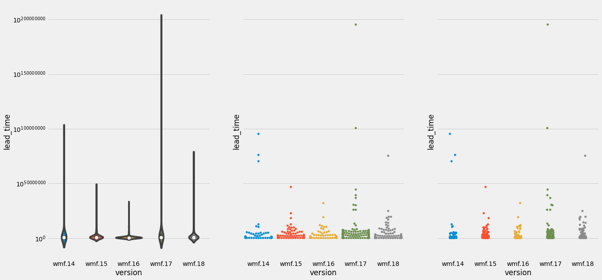

# Train Stats

```
 ----------------------------------------------------------------------------------------
/                                                                                        \
| /$$$$$$$$                 /$$            /$$$$$$   /$$                 /$$             |
||__  $$__/                |__/           /$$__  $$ | $$                | $$             |
|   | $$  /$$$$$$  /$$$$$$  /$$ /$$$$$$$ | $$  \__//$$$$$$    /$$$$$$  /$$$$$$   /$$$$$$$|
|   | $$ /$$__  $$|____  $$| $$| $$__  $$|  $$$$$$|_  $$_/   |____  $$|_  $$_/  /$$_____/|
|   | $$| $$  \__/ /$$$$$$$| $$| $$  \ $$ \____  $$ | $$      /$$$$$$$  | $$   |  $$$$$$ |
|   | $$| $$      /$$__  $$| $$| $$  | $$ /$$  \ $$ | $$ /$$ /$$__  $$  | $$ /$$\____  $$|
|   | $$| $$     |  $$$$$$$| $$| $$  | $$|  $$$$$$/ |  $$$$/|  $$$$$$$  |  $$$$//$$$$$$$/|
|   |__/|__/      \_______/|__/|__/  |__/ \______/   \___/   \_______/   \___/ |_______/ |
|                                                                                        |
|                                                                                        |
|                                                                                        |
|                                      🚂 ¯\_(ツ)_/¯?                                     |
\                                                                                        /
 ----------------------------------------------------------------------------------------
    \     
     \     
      \      
           ___ ____
         ⎛   ⎛ ,----
          \  //==--'
     _//|,.·//==--'    ____________________________
    _OO≣=-  ︶ ᴹw ⎞_§ ______  ___\ ___\ ,\__ \/ __ \
   (∞)_, )  (     |  ______/__  \/ /__ / /_/ / /_/ /
     ¨--¨|| |- (  / ______\____/ \___/ \__^_/  .__/
         ««_/  «_/ jgs/bd808                /_/
```

In which I look at data from the past several hundred trains and pretend that I know how to do exploratory data analysis.


```python
import pandas as pd
from matplotlib import pyplot as plt
import seaborn as sns

from sqlalchemy import create_engine
    
engine = create_engine('sqlite:///data/train.db')
df = pd.read_sql('''
SELECT
    version,
    rollbacks,
    rollbacks_time,
    group2_delay_days,
    (group0_delay_days +
     group1_delay_days +
     group2_delay_days) as total_delay,
    total_time as train_total_time,
    (select count(*) from blocker b where b.train_id = t.id) as blockers,
    (select count(*) from blocker b where b.train_id = t.id and resolved = 1) as resolved_blockers,
    patches,
    (select max(time_in_review) from patch p where p.train_id = t.id) as max_time_in_review,
    (select max(comments) from patch where patch.train_id = t.id) as max_comments_per_patch,
    (select max(start_time - created) from patch p where p.train_id = t.id) as max_cycle_time
FROM train t
''', engine)

# Makes your data 538% better...I think
plt.style.use('fivethirtyeight')
df.head()
```


<div>
<style scoped>
    .dataframe tbody tr th:only-of-type {
        vertical-align: middle;
    }

    .dataframe tbody tr th {
        vertical-align: top;
    }

    .dataframe thead th {
        text-align: right;
    }
</style>
<table border="1" class="dataframe">
  <thead>
    <tr style="text-align: right;">
      <th></th>
      <th>version</th>
      <th>rollbacks</th>
      <th>rollbacks_time</th>
      <th>group2_delay_days</th>
      <th>total_delay</th>
      <th>train_total_time</th>
      <th>blockers</th>
      <th>resolved_blockers</th>
      <th>patches</th>
      <th>max_time_in_review</th>
      <th>max_comments_per_patch</th>
      <th>max_cycle_time</th>
    </tr>
  </thead>
  <tbody>
    <tr>
      <th>0</th>
      <td>1.37.0-wmf.1</td>
      <td>0</td>
      <td>0</td>
      <td>0</td>
      <td>0</td>
      <td>178349</td>
      <td>5</td>
      <td>3</td>
      <td>450</td>
      <td>36809044</td>
      <td>27</td>
      <td>36952873</td>
    </tr>
    <tr>
      <th>1</th>
      <td>1.37.0-wmf.3</td>
      <td>3</td>
      <td>94493</td>
      <td>0</td>
      <td>1</td>
      <td>219880</td>
      <td>7</td>
      <td>6</td>
      <td>366</td>
      <td>56122286</td>
      <td>30</td>
      <td>56562620</td>
    </tr>
    <tr>
      <th>2</th>
      <td>1.37.0-wmf.4</td>
      <td>1</td>
      <td>66812</td>
      <td>1</td>
      <td>3</td>
      <td>263742</td>
      <td>9</td>
      <td>4</td>
      <td>422</td>
      <td>38820872</td>
      <td>29</td>
      <td>38982601</td>
    </tr>
    <tr>
      <th>3</th>
      <td>1.36.0-wmf.1</td>
      <td>0</td>
      <td>0</td>
      <td>4</td>
      <td>4</td>
      <td>519622</td>
      <td>1</td>
      <td>1</td>
      <td>566</td>
      <td>47181045</td>
      <td>31</td>
      <td>47755190</td>
    </tr>
    <tr>
      <th>4</th>
      <td>1.36.0-wmf.2</td>
      <td>4</td>
      <td>389769</td>
      <td>4</td>
      <td>5</td>
      <td>554704</td>
      <td>7</td>
      <td>1</td>
      <td>273</td>
      <td>110996452</td>
      <td>33</td>
      <td>111569626</td>
    </tr>
  </tbody>
</table>
</div>


```python
fig, ax = plt.subplots(figsize=(10,10))         # Sample figsize in inches
sns.heatmap(df.corr(), annot=True, cmap="YlGnBu", linewidths=0.3, annot_kws={"size": 8}, ax=ax)
plt.xticks(rotation=90)
plt.yticks(rotation=0)
plt.show()
```


```python
df.set_index('version')['blockers'].hist(figsize=(12, 10))
plt.xlabel("Blockers", labelpad=15)
plt.title("Blockers per Train", y=1.02, fontsize=22)
```


    Text(0.5, 1.02, 'Blockers per Train')


```python
df[df['blockers'] > 10].sort_values(by='blockers', ascending=False)
```


<div>
<style scoped>
    .dataframe tbody tr th:only-of-type {
        vertical-align: middle;
    }

    .dataframe tbody tr th {
        vertical-align: top;
    }

    .dataframe thead th {
        text-align: right;
    }
</style>
<table border="1" class="dataframe">
  <thead>
    <tr style="text-align: right;">
      <th></th>
      <th>version</th>
      <th>rollbacks</th>
      <th>rollbacks_time</th>
      <th>group2_delay_days</th>
      <th>total_delay</th>
      <th>train_total_time</th>
      <th>blockers</th>
      <th>resolved_blockers</th>
      <th>patches</th>
      <th>max_time_in_review</th>
      <th>max_comments_per_patch</th>
      <th>max_cycle_time</th>
    </tr>
  </thead>
  <tbody>
    <tr>
      <th>82</th>
      <td>1.34.0-wmf.20</td>
      <td>1</td>
      <td>16897</td>
      <td>5</td>
      <td>5</td>
      <td>600096</td>
      <td>20</td>
      <td>11</td>
      <td>413</td>
      <td>60583935</td>
      <td>37</td>
      <td>60715205</td>
    </tr>
    <tr>
      <th>103</th>
      <td>1.33.0-wmf.22</td>
      <td>0</td>
      <td>0</td>
      <td>0</td>
      <td>1</td>
      <td>63844</td>
      <td>17</td>
      <td>11</td>
      <td>391</td>
      <td>107411197</td>
      <td>45</td>
      <td>107659715</td>
    </tr>
    <tr>
      <th>77</th>
      <td>1.34.0-wmf.14</td>
      <td>2</td>
      <td>412678</td>
      <td>4</td>
      <td>5</td>
      <td>524983</td>
      <td>16</td>
      <td>7</td>
      <td>646</td>
      <td>73502579</td>
      <td>34</td>
      <td>73539481</td>
    </tr>
    <tr>
      <th>136</th>
      <td>1.31.0-wmf.20</td>
      <td>2</td>
      <td>134534</td>
      <td>1</td>
      <td>5</td>
      <td>255075</td>
      <td>14</td>
      <td>12</td>
      <td>822</td>
      <td>66099647</td>
      <td>75</td>
      <td>67210868</td>
    </tr>
    <tr>
      <th>124</th>
      <td>1.32.0-wmf.22</td>
      <td>0</td>
      <td>0</td>
      <td>0</td>
      <td>0</td>
      <td>173055</td>
      <td>12</td>
      <td>7</td>
      <td>824</td>
      <td>64869761</td>
      <td>44</td>
      <td>65392036</td>
    </tr>
    <tr>
      <th>57</th>
      <td>1.35.0-wmf.31</td>
      <td>3</td>
      <td>365118</td>
      <td>4</td>
      <td>15</td>
      <td>516489</td>
      <td>11</td>
      <td>7</td>
      <td>427</td>
      <td>72215548</td>
      <td>70</td>
      <td>72206585</td>
    </tr>
    <tr>
      <th>76</th>
      <td>1.34.0-wmf.13</td>
      <td>2</td>
      <td>14912</td>
      <td>0</td>
      <td>1</td>
      <td>183853</td>
      <td>11</td>
      <td>8</td>
      <td>471</td>
      <td>53208155</td>
      <td>23</td>
      <td>53820019</td>
    </tr>
  </tbody>
</table>
</div>


```python
block_df = pd.read_sql('''
SELECT
    version,
    group_blocked
FROM train t
JOIN blocker b ON t.id = b.train_id
''', engine)
block_df.head()
```


<div>
<style scoped>
    .dataframe tbody tr th:only-of-type {
        vertical-align: middle;
    }

    .dataframe tbody tr th {
        vertical-align: top;
    }

    .dataframe thead th {
        text-align: right;
    }
</style>
<table border="1" class="dataframe">
  <thead>
    <tr style="text-align: right;">
      <th></th>
      <th>version</th>
      <th>group_blocked</th>
    </tr>
  </thead>
  <tbody>
    <tr>
      <th>0</th>
      <td>1.37.0-wmf.7</td>
      <td>-1</td>
    </tr>
    <tr>
      <th>1</th>
      <td>1.37.0-wmf.7</td>
      <td>-1</td>
    </tr>
    <tr>
      <th>2</th>
      <td>1.37.0-wmf.12</td>
      <td>2</td>
    </tr>
    <tr>
      <th>3</th>
      <td>1.37.0-wmf.12</td>
      <td>1</td>
    </tr>
    <tr>
      <th>4</th>
      <td>1.37.0-wmf.12</td>
      <td>1</td>
    </tr>
  </tbody>
</table>
</div>


```python
block_df.group_blocked.unique()
```


    array([-1,  2,  1,  0])


```python
group_name_map = {
    -1: "Earlier",
    0: "Group0",
    1: "Group1",
    2: "Group2",
}
block_df['blocker_added'] = block_df.group_blocked.map(group_name_map)
block_df.head()
```


<div>
<style scoped>
    .dataframe tbody tr th:only-of-type {
        vertical-align: middle;
    }

    .dataframe tbody tr th {
        vertical-align: top;
    }

    .dataframe thead th {
        text-align: right;
    }
</style>
<table border="1" class="dataframe">
  <thead>
    <tr style="text-align: right;">
      <th></th>
      <th>version</th>
      <th>group_blocked</th>
      <th>blocker_added</th>
    </tr>
  </thead>
  <tbody>
    <tr>
      <th>0</th>
      <td>1.37.0-wmf.7</td>
      <td>-1</td>
      <td>Earlier</td>
    </tr>
    <tr>
      <th>1</th>
      <td>1.37.0-wmf.7</td>
      <td>-1</td>
      <td>Earlier</td>
    </tr>
    <tr>
      <th>2</th>
      <td>1.37.0-wmf.12</td>
      <td>2</td>
      <td>Group2</td>
    </tr>
    <tr>
      <th>3</th>
      <td>1.37.0-wmf.12</td>
      <td>1</td>
      <td>Group1</td>
    </tr>
    <tr>
      <th>4</th>
      <td>1.37.0-wmf.12</td>
      <td>1</td>
      <td>Group1</td>
    </tr>
  </tbody>
</table>
</div>


```python
block_df.group_blocked.value_counts()
```


    -1    244
     1    235
     0    181
     2     93
    Name: group_blocked, dtype: int64


```python
block_df.version
```


    0       1.37.0-wmf.7
    1       1.37.0-wmf.7
    2      1.37.0-wmf.12
    3      1.37.0-wmf.12
    4      1.37.0-wmf.12
               ...      
    748    1.37.0-wmf.18
    749    1.37.0-wmf.18
    750    1.37.0-wmf.18
    751    1.37.0-wmf.18
    752    1.37.0-wmf.18
    Name: version, Length: 753, dtype: object


```python
block_df.set_index('version')
block_df.sort_values('group_blocked', inplace=True)


fig = plt.figure(figsize=(16,6))
plt.grid(color='white', lw=0.5, axis='x')
n, bins, patches = plt.hist(block_df.blocker_added, bins=4, rwidth=0.95)

xticks = [(bins[idx+1] + value)/2 for idx, value in enumerate(bins[:-1])]
xticks_labels = [ "{:.2f}\nto\n{:.2f}".format(value, bins[idx+1]) for idx, value in enumerate(bins[:-1])]
plt.xticks(xticks, labels=["Before group0", "Group0", "Group1", "Group2"])

# remove y ticks
plt.yticks([])

# plot values on top of bars
for idx, value in enumerate(n):
    if value > 0:
        plt.text(xticks[idx], value+5, int(value), ha='center')

plt.title('Train Blockers by Group Where They Were Discovered', loc='left', pad=30)
plt.show()

```


```python
patches = pd.read_sql('''
SELECT
    link,
    version,
    submitted,
    insertions as ins,
    (deletions*-1) as del
FROM patch p JOIN train t ON t.id = p.train_id
''', engine)
patches.describe()
```


<div>
<style scoped>
    .dataframe tbody tr th:only-of-type {
        vertical-align: middle;
    }

    .dataframe tbody tr th {
        vertical-align: top;
    }

    .dataframe thead th {
        text-align: right;
    }
</style>
<table border="1" class="dataframe">
  <thead>
    <tr style="text-align: right;">
      <th></th>
      <th>submitted</th>
      <th>ins</th>
      <th>del</th>
    </tr>
  </thead>
  <tbody>
    <tr>
      <th>count</th>
      <td>6.161400e+04</td>
      <td>6.161400e+04</td>
      <td>6.161400e+04</td>
    </tr>
    <tr>
      <th>mean</th>
      <td>1.568369e+09</td>
      <td>4.153018e+02</td>
      <td>-3.599921e+02</td>
    </tr>
    <tr>
      <th>std</th>
      <td>3.353360e+07</td>
      <td>6.971539e+04</td>
      <td>6.699696e+04</td>
    </tr>
    <tr>
      <th>min</th>
      <td>1.431572e+09</td>
      <td>0.000000e+00</td>
      <td>-1.661412e+07</td>
    </tr>
    <tr>
      <th>25%</th>
      <td>1.539219e+09</td>
      <td>2.000000e+00</td>
      <td>-1.700000e+01</td>
    </tr>
    <tr>
      <th>50%</th>
      <td>1.570374e+09</td>
      <td>6.000000e+00</td>
      <td>-4.000000e+00</td>
    </tr>
    <tr>
      <th>75%</th>
      <td>1.594246e+09</td>
      <td>3.100000e+01</td>
      <td>-1.000000e+00</td>
    </tr>
    <tr>
      <th>max</th>
      <td>1.628584e+09</td>
      <td>1.728860e+07</td>
      <td>0.000000e+00</td>
    </tr>
  </tbody>
</table>
</div>


```python
patches['loc'] = patches['ins'] + patches['del']
patches.head()
```


<div>
<style scoped>
    .dataframe tbody tr th:only-of-type {
        vertical-align: middle;
    }

    .dataframe tbody tr th {
        vertical-align: top;
    }

    .dataframe thead th {
        text-align: right;
    }
</style>
<table border="1" class="dataframe">
  <thead>
    <tr style="text-align: right;">
      <th></th>
      <th>link</th>
      <th>version</th>
      <th>submitted</th>
      <th>ins</th>
      <th>del</th>
      <th>loc</th>
    </tr>
  </thead>
  <tbody>
    <tr>
      <th>0</th>
      <td>https://gerrit.wikimedia.org/r/#/q/ccbfcf28,n,z</td>
      <td>1.37.0-wmf.1</td>
      <td>1618945759</td>
      <td>5</td>
      <td>-1</td>
      <td>4</td>
    </tr>
    <tr>
      <th>1</th>
      <td>https://gerrit.wikimedia.org/r/#/q/3302274f,n,z</td>
      <td>1.37.0-wmf.1</td>
      <td>1618878371</td>
      <td>1156</td>
      <td>-660</td>
      <td>496</td>
    </tr>
    <tr>
      <th>2</th>
      <td>https://gerrit.wikimedia.org/r/#/q/8b5471b5,n,z</td>
      <td>1.37.0-wmf.1</td>
      <td>1618343309</td>
      <td>976</td>
      <td>-3</td>
      <td>973</td>
    </tr>
    <tr>
      <th>3</th>
      <td>https://gerrit.wikimedia.org/r/#/q/a6abbb67,n,z</td>
      <td>1.37.0-wmf.1</td>
      <td>1618341075</td>
      <td>8</td>
      <td>-29</td>
      <td>-21</td>
    </tr>
    <tr>
      <th>4</th>
      <td>https://gerrit.wikimedia.org/r/#/q/af916aad,n,z</td>
      <td>1.37.0-wmf.1</td>
      <td>1618300868</td>
      <td>7</td>
      <td>-5</td>
      <td>2</td>
    </tr>
  </tbody>
</table>
</div>


```python
patches['submitted'] = pd.to_datetime(patches['submitted'], unit='s')
patches.set_index('submitted', inplace=True)
```


```python
out = patches.groupby(pd.Grouper(freq='M')).apply(lambda x: x)
out = out[out['link'] != 'https://gerrit.wikimedia.org/r/#/q/9a08dbab,n,z'] # The one patch that inserts 17.2M lines of code
out['ok'] = out['loc'].cumsum()
```

## Cycle time/Lead time

**Cycle time** is the time from when a patch enters code review to the time that it's in production. **Lead time** is the time it takes from commit to production.


```python
# GOAL
#         train     lead_time    cycle_time   Id
# 0    1.37.0-wmf.6    200   2000   u1234
# 1    1.37.0-wmf.6    123   2800   u1235

cycle = pd.read_sql('''
SELECT
    substr(version, 8) as version,
    datetime(start_time, 'unixepoch'),
    (start_time - created) as lead_time,
    (start_time - submitted) as cycle_time,
    datetime(created, 'unixepoch'),
    datetime(submitted, 'unixepoch'),
    link
FROM patch p JOIN train t ON t.id = p.train_id
WHERE (lead_time > 0 AND cycle_time > 0)
    AND (
        version = '1.37.0-wmf.14' OR
        version = '1.37.0-wmf.15' OR
        version = '1.37.0-wmf.16' OR
        version = '1.37.0-wmf.17' OR
        version = '1.37.0-wmf.18'
    )
''', engine)
cycle.head()
```


<div>
<style scoped>
    .dataframe tbody tr th:only-of-type {
        vertical-align: middle;
    }

    .dataframe tbody tr th {
        vertical-align: top;
    }

    .dataframe thead th {
        text-align: right;
    }
</style>
<table border="1" class="dataframe">
  <thead>
    <tr style="text-align: right;">
      <th></th>
      <th>version</th>
      <th>datetime(start_time, 'unixepoch')</th>
      <th>lead_time</th>
      <th>cycle_time</th>
      <th>datetime(created, 'unixepoch')</th>
      <th>datetime(submitted, 'unixepoch')</th>
      <th>link</th>
    </tr>
  </thead>
  <tbody>
    <tr>
      <th>0</th>
      <td>wmf.14</td>
      <td>2021-07-13 22:15:46</td>
      <td>50935</td>
      <td>49822</td>
      <td>2021-07-13 08:06:51</td>
      <td>2021-07-13 08:25:24</td>
      <td>https://gerrit.wikimedia.org/r/q/704204</td>
    </tr>
    <tr>
      <th>1</th>
      <td>wmf.14</td>
      <td>2021-07-13 22:15:46</td>
      <td>3619864</td>
      <td>66729</td>
      <td>2021-06-02 00:44:42</td>
      <td>2021-07-13 03:43:37</td>
      <td>https://gerrit.wikimedia.org/r/q/697641</td>
    </tr>
    <tr>
      <th>2</th>
      <td>wmf.14</td>
      <td>2021-07-13 22:15:46</td>
      <td>113413</td>
      <td>64290</td>
      <td>2021-07-12 14:45:33</td>
      <td>2021-07-13 04:24:16</td>
      <td>https://gerrit.wikimedia.org/r/q/704070</td>
    </tr>
    <tr>
      <th>3</th>
      <td>wmf.14</td>
      <td>2021-07-13 22:15:46</td>
      <td>147105</td>
      <td>57177</td>
      <td>2021-07-12 05:24:01</td>
      <td>2021-07-13 06:22:49</td>
      <td>https://gerrit.wikimedia.org/r/q/703949</td>
    </tr>
    <tr>
      <th>4</th>
      <td>wmf.14</td>
      <td>2021-07-13 22:15:46</td>
      <td>255812</td>
      <td>115733</td>
      <td>2021-07-10 23:12:14</td>
      <td>2021-07-12 14:06:53</td>
      <td>https://gerrit.wikimedia.org/r/q/703907</td>
    </tr>
  </tbody>
</table>
</div>


```python
from matplotlib import ticker as mticker
import numpy as np

# Adapted from <https://stackoverflow.com/a/60132262>
fig, ax = plt.subplots(1, 3, sharey=True, figsize=(20,10))
sns.violinplot(data=cycle,x='version', y='lead_time', ax=ax[0])
sns.swarmplot(data=cycle,x='version', y='lead_time', ax=ax[1])
sns.stripplot(data=cycle,x='version', y='lead_time', ax=ax[2])
ax[0].yaxis.set_major_formatter(mticker.StrMethodFormatter("$10^{{{x:.0f}}}$"))
ax[0].yaxis.set_ticks([np.log10(x) for p in range(-6,1) for x in np.linspace(10**p, 10**(p+1), 10)], minor=True)
plt.show()
```

    /usr/lib/python3/dist-packages/seaborn/categorical.py:1296: UserWarning: 79.2% of the points cannot be placed; you may want to decrease the size of the markers or use stripplot.
      warnings.warn(msg, UserWarning)
    /usr/lib/python3/dist-packages/seaborn/categorical.py:1296: UserWarning: 79.0% of the points cannot be placed; you may want to decrease the size of the markers or use stripplot.
      warnings.warn(msg, UserWarning)
    /usr/lib/python3/dist-packages/seaborn/categorical.py:1296: UserWarning: 90.1% of the points cannot be placed; you may want to decrease the size of the markers or use stripplot.
      warnings.warn(msg, UserWarning)
    /usr/lib/python3/dist-packages/seaborn/categorical.py:1296: UserWarning: 79.4% of the points cannot be placed; you may want to decrease the size of the markers or use stripplot.
      warnings.warn(msg, UserWarning)
    /usr/lib/python3/dist-packages/seaborn/categorical.py:1296: UserWarning: 79.5% of the points cannot be placed; you may want to decrease the size of the markers or use stripplot.
      warnings.warn(msg, UserWarning)





```python

```
